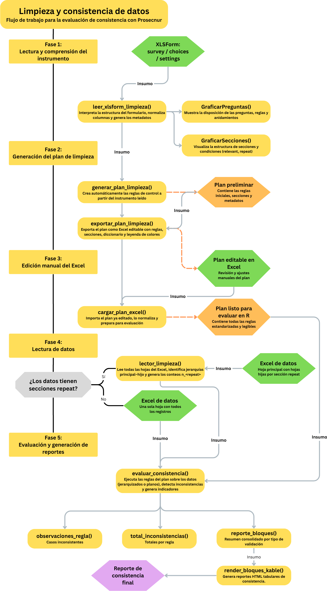
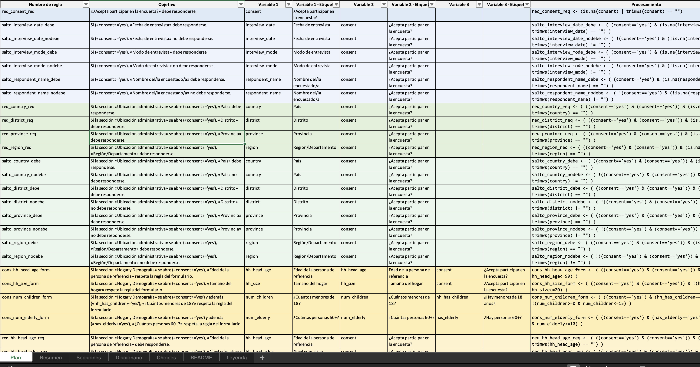
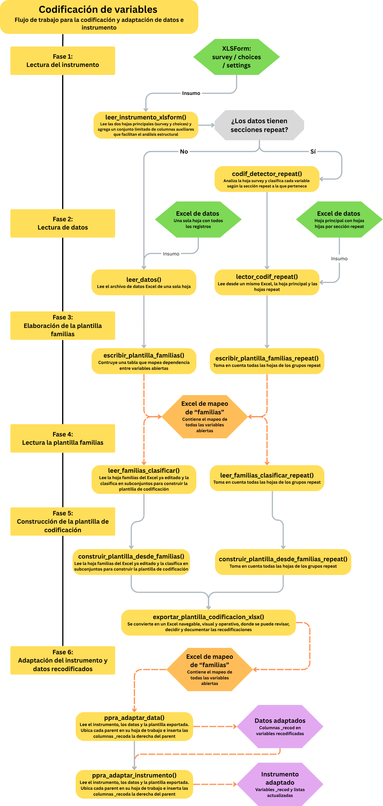
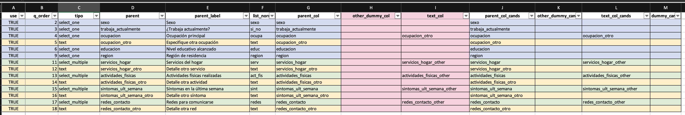
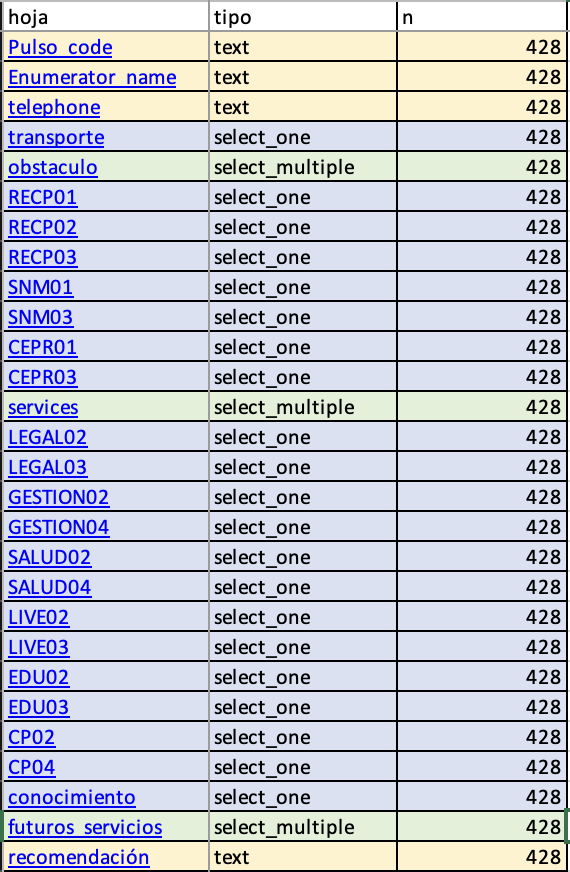
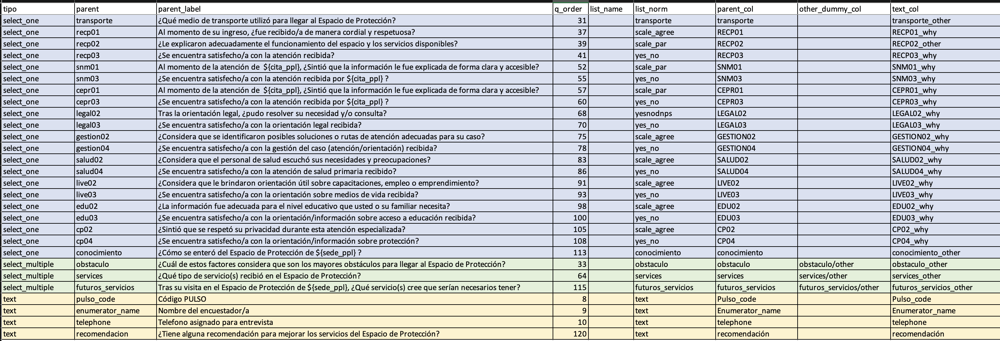
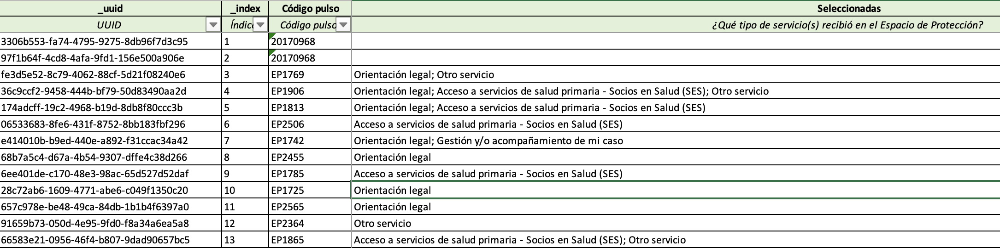
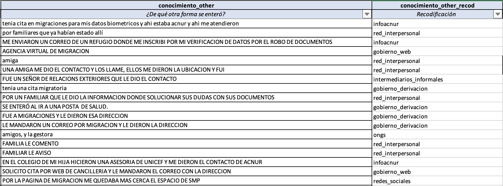
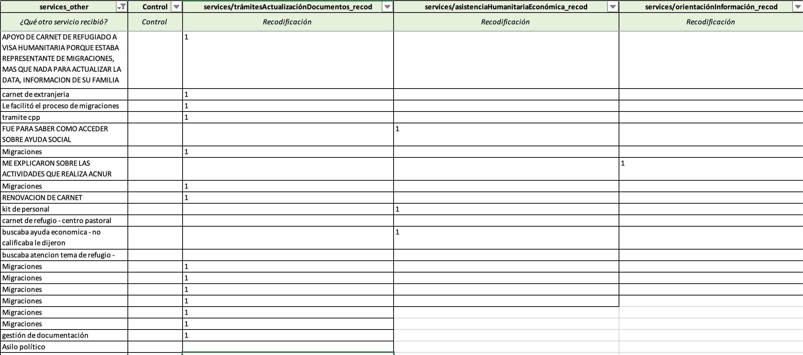
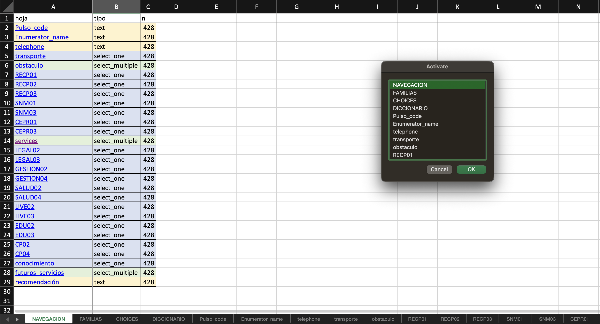

```{r echo=FALSE}
#| message: false
#| warning: false

# Paquetes
library(knitr)
library(kableExtra)
library(tidyverse)
library(htmltools)

# NAs vacíos
options(knitr.kable.NA = "")

# ---- Helper principal: estilo + scroll condicional ----
kbl_pro <- function(x,
                    caption = NULL,
                    nrows_scroll = 12,
                    scroll_y = "420px",
                    escape  = TRUE,
                    align   = "l",
                    ...) {

  tb <- kableExtra::kbl(
    x,
    format      = "html",
    caption     = caption,
    escape      = escape,
    align       = align,
    table.attr  = 'class="tabla-pro"',  
    ...
  ) |>
    kableExtra::kable_styling(
      full_width = FALSE,
      bootstrap_options = c("striped", "hover", "condensed", "responsive"),
      font_size = 13
    )

  # Activa scroll si supera nrows_scroll
  if (nrow(as.data.frame(x)) > nrows_scroll) {
    tb <- kableExtra::scroll_box(
      tb,
      width   = "100%",
      height  = scroll_y,
      box_css = "class:kable-scroll"
    )
  }

  knitr::asis_output(as.character(tb))
}

# ---- Versión que pinta 'Procesamiento' como <code> de forma segura ----
kbl_code_safe <- function(df, ...) {
  d <- df
  nm <- names(d)
  proc_cols <- which(tolower(nm) %in% c("procesamiento","processing"))
  if (length(proc_cols)) {
    html_code <- function(x) HTML(paste0("<code>", htmlEscape(as.character(x)), "</code>"))
    for (j in proc_cols) d[[j]] <- vapply(d[[j]], html_code, FUN.VALUE = HTML(""))
    kbl_pro(d, escape = FALSE, ...)
  } else {
    kbl_pro(d, escape = TRUE, ...)
  }
}

# ---- Que todos los data frames usen este estilo por defecto ----
knitr::opts_chunk$set(
  df_print = function(x, ...) kbl_pro(x, ...)
)
```

```{r}
#| eval: false
#| include: false
library(magick)
img <- image_read("images/Limpieza_consistencia_datos.png")
img_crop <- image_trim(img)  # elimina bordes blancos automáticos
image_write(img_crop, "images/Limpieza_consistencia_datos_trim.png")
```

# Introducción

El paquete **prosecnur** fue diseñado para acompañar el procesamiento una encuesta realizada en Kobo. En muchos proyectos de investigación o monitoreo social los cuestionarios se aplican mediante dispositivos móviles. Estas herramientas recogen la información en archivos estructurados que se conocen como **formularios XLSForm**. Detrás de ese nombre hay simplemente un archivo Excel que define las preguntas de la encuesta, sus opciones de respuesta y la forma en que se almacenará cada dato. Cuando la encuesta se completa, la información se descarga en una base de datos que refleja esa estructura. A menudo, sin embargo, esa base contiene errores menores, respuestas abiertas difíciles de interpretar o categorías que necesitan ser reagrupadas. El trabajo de limpieza y codificación consiste precisamente en revisar, corregir y documentar esas decisiones de manera transparente.

**Prosecnur** surge de esa necesidad. Permite organizar la información sin alterar los datos originales, registrar cada corrección en un entorno controlado y traducir esas decisiones a un instrumento actualizado.

El objetivo general es garantizar que los datos finales mantengan la coherencia interna del cuestionario, que las recodificaciones sean auditables y que las decisiones puedan revisarse en cualquier momento. El paquete reúne en un mismo espacio funciones que automatizan tareas, generan plantillas editables en Excel y reproducen la estructura del formulario sin exigir conocimientos técnicos avanzados. Cada etapa puede revisarse por separado, pero todas se articulan en una secuencia lógica que refleja el modo en que se trabaja realmente con datos de encuestas.

En el fondo, **prosecnur** no busca solo procesar datos, sino **hacer visible el proceso de construcción de la información**. El usuario puede leer el instrumento, entender la lógica de cada pregunta, revisar la consistencia de las respuestas, aplicar reglas, crear plantillas de codificación y finalmente adaptar los datos y el formulario. Todo el flujo queda documentado y puede replicarse tantas veces como sea necesario, garantizando que el análisis posterior se base siempre en una versión limpia, coherente y trazable de la información.

## **Flujo del paquete**

El flujo de trabajo del paquete **Prosecnur** puede entenderse como una secuencia que transforma dos insumos básicos en un conjunto ordenado de productos finales. Los insumos iniciales son el **instrumento de la encuesta** y la **base de datos resultante de la recolección**. A partir de ellos, el paquete conduce un proceso progresivo que atraviesa cuatro momentos fundamentales: lectura y validación del instrumento, evaluación de consistencia, codificación y adaptación.

En la primera etapa, el instrumento se lee tal como fue diseñado. Se identifican las preguntas, los tipos de respuesta y las relaciones entre las partes del formulario. Esta lectura permite construir una representación estructurada del cuestionario, que luego se utilizará como referencia para todo el proceso. Básicamente, el paquete aprende cómo está construida la encuesta y cómo deben interpretarse sus columnas en los datos.

En la segunda etapa, se realiza la **evaluación de consistencia**. Este paso consiste en revisar si las respuestas registradas por los encuestadores cumplen las reglas básicas del cuestionario. Por ejemplo, si una persona indicó que no asiste a la escuela, no debería aparecer luego una respuesta sobre el grado que cursa. Estas comparaciones se formulan como reglas automáticas que el paquete aplica sobre toda la base de datos, identificando casos inconsistentes y generando reportes que permiten decidir si es necesario corregir o mantener los valores observados. Esta fase no altera los datos originales: simplemente los revisa, los resume y los presenta de forma legible para luego ser corregidos.

El tercer momento corresponde a la **codificación de respuestas abiertas**, se convierten preguntas abiertas y valores numéricos en categorías comparables. Aquí el paquete genera plantillas de trabajo en Excel que ordenan las variables, los campos asociados y las relaciones de dependencia entre las variables (una mapeo de la "familia"). Luego, esto da como resultado una plantilla de codificación en Excel que permite, a través de un llenaod específico la elaboración de categorías para las preguntas abiertas, rectificación a una variable ya existente o la creación de nuevas categorías.

Finalmente, en la etapa de **adaptación**, el paquete transforma la plantilla en un producto consolidado. Primero crea un nuevo archivo de datos con todas las columnas de recodificación integradas, respetando la estructura original del cuestionario. Luego adapta el propio instrumento XLSForm, incorporando las nuevas categorías y listas derivadas de la codificación.

```{r, message=FALSE, warning=FALSE}
library(tidyverse)
library(prosecnur)
```

# Consistencia de datos

Esta fase suele ser la primera del procesamiento, aunque puede desarrollarse en paralelo con la codificación. Su propósito es evaluar la **consistencia interna de la información recolectada** a partir de un formulario diseñado en **KoboToolbox** o en cualquier instrumento estructurado bajo formato **XLSForm**. La idea central es comprobar que los datos respeten la **lógica del cuestionario aplicado**: que las preguntas obligatorias estén respondidas, que los saltos y condiciones funcionen correctamente, y que los valores registrados sean coherentes con lo permitido por el instrumento.

El proceso se construye a partir de tres etapas complementarias. En primer lugar, se realiza una **lectura integral del formulario**, lo que permite conocer en detalle la estructura del cuestionario, sus secciones, condiciones de apertura y relaciones entre variables. A partir de esa lectura, el sistema genera de manera automática un **plan de limpieza**, que traduce toda esa lógica en un conjunto ordenado de reglas listas para ejecutarse sobre la base de datos. Finalmente, esas reglas se **evalúan sistemáticamente** sobre los registros recolectados, marcando las observaciones que presentan inconsistencias y produciendo un resumen estructurado de resultados.

A lo largo de este flujo intervienen tanto **componentes automáticos**, que interpretan y ejecutan la lógica declarada en el instrumento, como **etapas manuales**, en las que los resultados se revisan, comentan y ajustan según el contexto de campo, siendo el flujo el siguiente:

{fig-align="center" width="100%"}

Esta combinación permite mantener un proceso de limpieza **reproducible y transparente**, en el que cada control puede rastrearse hasta la regla que lo originó y la pregunta que lo sustenta. El resultado no solo es una base más depurada, sino también un registro claro de cómo se llegó a cada corrección.

Se procede a describir una a una las funciones que conforman este flujo, explicando sus argumentos, los objetos que generan y los usos prácticos que pueden tener en el análisis y la documentación del proceso.

## leer_xlsform_limpieza()

La función `leer_xlsform_limpieza()` es el punto de partida del flujo de trabajo de *Prosecnur*. Su propósito es comprender a fondo la estructura del instrumento de recolección de datos, es decir, el formulario **XLSForm** que define el funcionamiento del cuestionario.

En términos prácticos, la función toma como entrada un archivo Excel que contiene las tres hojas que componen cualquier formulario ODK o KoBo: **survey**, **choices** y **settings**.

### Hoja survey

La hoja **survey** es el núcleo del formulario, ya que describe todas las preguntas, variables y estructuras jerárquicas del cuestionario. Cada fila corresponde a una unidad lógica (una pregunta al entrevistado, una nota o el incio/final de una sección del cuestionario) y las columnas especifican sus propiedades principales. Entre las más relevantes se encuentran:

-   **type**, que indica el tipo de ítem (por ejemplo, select_one, integer, text, calculate, etc.), y define el comportamiento esperado de la pregunta.

-   **name**, que establece el nombre técnico de la variable en la base de datos final, asegurando su trazabilidad durante el procesamiento.

-   **label::idioma**, que contiene el texto visible para el encuestador o la persona entrevistada, pudiendo coexistir varias versiones lingüísticas.

-   **relevant**, que define las condiciones bajo las cuales la pregunta debe mostrarse.

-   **constraint**, que establece restricciones o validaciones sobre la respuesta.

-   **required**, que determina si el ítem es obligatorio.

Estas columnas, en conjunto, permiten reconstruir la lógica del instrumento, identificando cuándo debe aparecer cada pregunta, bajo qué condiciones se valida y qué relaciones mantiene con otras variables. Además, las marcas de inicio y cierre de secciones (*begin_group*, *end_group*) y de bloques repetidos (*begin_repeat*, *end_repeat*) proporcionan la estructura jerárquica del formulario, lo que permite distinguir módulos, submódulos y niveles de repetición. Con toda esta información, la función puede reconstruir el orden lógico del cuestionario y generar un mapa detallado de su arquitectura interna.

### Hoja choices

La hoja **choices** complementa la información anterior al definir los catálogos de opciones de respuesta utilizados por las preguntas de tipo select_one o select_multiple. En ella, cada grupo de opciones se organiza bajo un identificador común (*list_name*), que agrupa las posibles respuestas de una misma lista. Sus columnas principales son:

-   **list_name**, que nombra cada lista de opciones y permite vincularla con las preguntas que la utilizan.

-   **name**, que contiene los códigos internos de las opciones, es decir, los valores que se almacenarán en la base de datos.

-   **label::idioma**, que incluye las etiquetas visibles para el encuestador o la persona entrevistada.

Este diseño garantiza la consistencia de los catálogos utilizados en el formulario y evita duplicaciones o discrepancias entre las listas de respuesta. En algunos casos, la hoja *choices* incluye columnas adicionales que permiten establecer **relaciones jerárquicas** entre listas, lo que habilita filtros condicionales como los que vinculan país, región, provincia o distrito. Estas dependencias son detectadas automáticamente por la función, que las documenta dentro del objeto resultante e identifica qué preguntas dependen de otras.

El resultado final de leer_xlsform_limpieza() es un **objeto R estructurado** que integra las tres hojas leídas y normalizadas, junto con un conjunto de metadatos y resúmenes derivados. Este objeto sintetiza la estructura lógica del formulario, las relaciones entre preguntas, las jerarquías de secciones y los vínculos entre catálogos, además de incluir diagnósticos internos que facilitan la detección de inconsistencias en el diseño del instrumento antes de procesar los datos. En la práctica, dicho objeto se convierte en el insumo central de las siguientes etapas del flujo de trabajo en *Prosecnur*:

-   La generación automática del plan de limpieza

-   La evaluación sistemática de consistencias

-   La exportación de un plan editable para revisión manual

### Parámetros de entrada

La función tiene una serie de parámetros opcionales en función del tipo de proyecto:

```{r, echo=FALSE}
parametros_tabla <- tibble::tribble(
  ~Parámetro,             ~Descripción,                                                                                                                       ~`Valor por defecto`,   ~`Ejemplo de uso`,
  "path",                 "Ruta al archivo .xlsx del formulario. Debe contener al menos las hojas survey, choices y settings.",                               "(obligatorio)",        "\"instrumento.xlsx\"",
  "lang",                 "Idioma de extracción de etiquetas. Si el formulario tiene columnas label::es, label::en, etc., aquí se define cuál usar.",          "\"es\"",               "\"en\" para trabajar en inglés o \"fr\" para francés.",
  "prefer_label",         "Columna de etiqueta a priorizar. Si no se especifica, la función detecta automáticamente la correspondiente a lang.",               "NULL",                 "\"label::Español (es)\" si el encabezado usa un formato distinto.",
  "origen_prefijo",       "Criterio para generar prefijos automáticos de sección. Puede tomar valores \"deducir\", \"nombre_grupo\" o \"etiqueta_grupo\".",   "\"deducir\"",          "\"nombre_grupo\" si se desea que los prefijos sigan el nombre técnico del grupo (hogar_, educ_, etc.).",
  "transformar_prefijo",  "Forma en que se normalizan los prefijos. \"mayúsculas\" los convierte en mayúsculas, \"tal_cual\" los deja igual, y \"simplificar\" los acorta eliminando tildes o caracteres especiales.", 
                          "\"mayúsculas\"",        "\"simplificar\" para generar prefijos cortos (HOG_, VIV_).",
  "sufijo_prefijo",       "Carácter o cadena que se agrega al final del prefijo.",                                      "\"_\"",                "\"-\" o \"\" para eliminar el sufijo.",
  "asegurar_unicidad",    "Si es TRUE, garantiza que los prefijos de las secciones sean únicos incluso si los nombres originales se repiten.",                 "TRUE",                 "FALSE si se desea mantener los nombres originales sin alteraciones.",
  "verbose",              "Si es TRUE, muestra un resumen en consola con el número de secciones, variables y dependencias detectadas.",                        "TRUE",                 "FALSE para ejecución silenciosa en scripts automáticos."
)

kbl_pro(parametros_tabla, caption = "Parámetros de la función leer_xlsform_limpieza()")
```

En la mayoría de los casos, basta con usar la configuración por defecto, sólo dándole la ruta del XLS Froms. Esto leerá las etiquetas en español (label::es), generará prefijos en mayúsculas a partir de los nombres de grupo y mostrará en consola un resumen del formulario detectado.

```{r, warning=FALSE}
inst = leer_xlsform_limpieza("instrumento.xlsx")
```

Como se peude observar el lector ya genera una lectura general del instrumento y muestra su estructura. Hasta allí no hace falta nada mas. Sin embargo, otros parámetros están a disposición de las necesidades del usuario. Por ejemplo:

```{r, warning=FALSE}
ejemplo = leer_xlsform_limpieza(
  "instrumento.xlsx",
  lang = "es",
  origen_prefijo = "etiqueta_grupo",
  sufijo_prefijo = "",
  verbose = FALSE
)
```

En este ejemplo algunos parámetros adicionales que modifican la forma en que se interpreta la estructura del formulario.

-   origen_prefijo = "etiqueta_grupo" define que los prefijos automáticos se generen a partir de las etiquetas visibles de los grupos, y no desde sus nombres técnicos ni mediante deducción automática.

-   A su vez, sufijo_prefijo = "" elimina el guion bajo que normalmente se agrega al final de cada prefijo, produciendo nombres de variables más compactos,

-   verbose = FALSE desactiva los mensajes de resumen en consola.

### Estructura del resultado

El objeto devuelto por la función es una **lista jerárquica** con los siguinetes objetos:

Sus principales elementos son los siguientes:

```{r, echo=FALSE}
tabla_lista <- tibble::tribble(
  ~Componente,     ~Contenido,                                                                                                                 ~`Uso principal`,
  "survey_raw",    "Versión cruda de la hoja survey, leída directamente desde el Excel, sin modificaciones.",                                 "Conserva la referencia original. Útil para auditorías o comparaciones entre versiones del formulario.",
  "choices_raw",   "Versión cruda de la hoja choices, con todas las listas de opciones.",                                                     "Permite rastrear los catálogos tal como fueron cargados.",
  "settings",      "Configuración general del formulario: título, versión, idioma y metadatos definidos en la hoja settings.",               "Documentación general del instrumento.",
  "survey",        "Hoja survey procesada: incluye nombre (name), tipo (type_base), etiqueta (label::lang), condiciones (relevant), restricciones (constraint), obligatoriedad (required) y vínculos (choice_filter).", 
                   "Núcleo lógico del instrumento. Base para generar reglas de limpieza o validar la estructura.",
  "choices",       "Listas de opciones procesadas: cada list_name con su conjunto de valores (name) y etiquetas (label), ya normalizados.",  "Control de catálogos y verificación de relaciones jerárquicas.",
  "meta",          "Lista de metadatos derivados: estructura de secciones (section_map), relaciones jerárquicas (choice_filter_summary), diagnósticos de integridad y prefijos generados.", 
                   "Navegación global y documentación automática."
)

kbl_pro(tabla_lista, caption = "Componentes principales del objeto devuelto por leer_xlsform_limpieza()")
```

### survey

Survey nos indica un data frame pro variables y sus características. Tomemos una muestra aleatoria de ejemplo:

```{r}
set.seed(345)
muestra = inst$survey[sample(nrow(inst$survey), 10), 
            c("name", "type_base", "label::es", 
              "relevant", "constraint")]
```

En esta pequeña muestra ya se observa el tipo de información que la función organiza: cada variable con su:

Tipo:

```{r}
muestra$type_base
```

su texto visible

```{r}
muestra$`label::es`
```

y las condiciones de activación o de validez, por ejemplo: las expresiones de relevant indican cuándo se debe mostrar la pregunta

```{r}
muestra$relevant
```

las de constraint definen los límites numéricos o lógicos de las respuestas

```{r}
muestra$constraint
```

### choices

El objeto **choices** contiene todas las listas de opciones empleadas por las preguntas de tipo select_one y select_multiple. Cada lista corresponde a un catálogo definido en la hoja *choices* del formulario, identificado por el campo list_name. Estas listas establecen los valores válidos que pueden tomar las variables categóricas del cuestionario y garantizan que los catálogos se mantengan consistentes entre secciones o módulos.

Cuando se consulta una lista en particular, por ejemplo la asociada al estado civil, se obtiene un conjunto de filas donde cada valor técnico (name) se vincula con su etiqueta visible (label::es).

```{r}
inst$choices %>%
  filter(list_name == "marital_status") %>% 
  select(list_name, name, `label::es`)
```

En este caso, la función muestra cinco categorías: soltero/a, casado/a, conviviente, separado/a y viudo/a. Este tipo de estructura es la que permite que el formulario almacene los códigos internos en la base de datos mientras mantiene la legibilidad en el cuestionario para el entrevistador o la persona encuestada.

En algunos formularios, las listas no son independientes, sino que mantienen relaciones jerárquicas entre sí. Es el caso de los catálogos geográficos o administrativos, donde la selección de un país determina las regiones disponibles, y cada región filtra las provincias o distritos que le corresponden. Estas relaciones, conocidas como *choice filters*, se registran en columnas adicionales dentro de la misma hoja *choices*, generalmente con nombres como country_code, region_code o province_code.

```{r}
inst$choices %>%
  filter(list_name %in% c("region", "province", "district")) %>% 
  select(-list_norm, -`label::English (EN)`, 
         - name)
```

Aquí, las listas de opciones establecen una relación jerárquica entre niveles geográficos. Cada registro incluye los códigos necesarios para mantener la correspondencia entre país, región, provincia y distrito. Las regiones se asocian a un país mediante la columna country_code, las provincias heredan el código de la región a la que pertenecen, y los distritos conservan el código de su provincia. Esta estructura permite que el formulario muestre únicamente las opciones válidas en función de las respuestas anteriores.

`leer_xlsform_limpieza()` identifica automáticamente estas dependencias y las documenta dentro del componente meta del objeto resultante. Este registro permite rastrear la jerarquía entre listas, validar la coherencia de los filtros condicionales y facilitar su integración posterior en el plan de limpieza.

### meta

El objeto meta es un contenedor de metadatos derivados que resumen la arquitectura del formulario, sus dependencias lógicas y la información necesaria para construir prefijos, mapear secciones, detectar jerarquías y documentar filtros condicionales.

```{r}
names(inst$meta)
```

Cada uno de estos elementos se resume en:

```{r, echo=FALSE}
library(tibble)
meta_overview <- tibble::tribble(
  ~Componente,              ~Descripción,
  "label_col_survey",       "Nombre exacto de la columna de etiqueta usada para survey, según el idioma y preferencias.",
  "label_col_choices",      "Nombre exacto de la columna de etiqueta usada para choices.",
  "groups_detail",          "Detalle por grupo o repeat con rango de filas en survey, profundidad, condición de apertura y repeat_count.",
  "section_map",            "Mapa consolidado de secciones con etiqueta, prefijo, condicionalidad, repeat y orden lógico.",
  "repeat_links",           "Vínculos padre–hijo para secciones repeat, con claves esperadas para enlazar.",
  "tabla_hojas",            "Resumen de nivel y descripción de cada tabla conceptual: principal y hojas repeat.",
  "lists_with_other",       "Presencia de opción 'Otro' por catálogo, útil para revisar campos asociados.",
  "choice_cols_by_list",    "Columnas no vacías y no decorativas en choices por lista, candidatas para filtros jerárquicos.",
  "choice_filter_summary",  "Documentación por pregunta de los filtros condicionales y sus dependencias.",
  "dynrefs",                "Selects con listas dinámicas del tipo select_* ${var}, con origen y vista previa.",
  "dynrefs_pretty",         "Versión formateada de dynrefs para impresión en resúmenes."
)
kbl_pro(meta_overview, caption = "Componentes del objeto inst$meta")
```

**groups_detail**

Tabla de cada sección que registra, para cada bloque begin_group o begin_repeat, su nombre técnico, etiqueta, filas de apertura y cierre en survey, profundidad de anidamiento y reglas declarativas de apertura. Integra, cuando existe, la expresión de repeat_count y las variables que ésta referencia.

```{r, echo=FALSE}
gd_schema <- tibble::tribble(
  ~Columna,            ~Significado,
  "gname",             "Nombre técnico del grupo tal como aparece en survey.",
  "glabel",            "Etiqueta visible del grupo utilizada como título de sección.",
  "begin_row",         "Fila de apertura del grupo en la hoja survey.",
  "end_row",           "Fila de cierre del grupo en la hoja survey.",
  "depth",             "Nivel de anidamiento del grupo dentro del cuestionario.",
  "is_repeat",         "Marca lógica que indica si el grupo es de tipo repeat.",
  "relevant",          "Expresión declarativa que controla la apertura del grupo.",
  "relevant_vars",     "Variables referenciadas dentro de la expresión relevant.",
  "appearance",        "Texto appearance asociado al grupo si aplica.",
  "repeat_count",      "Fórmula declarativa que define el número de repeticiones del repeat.",
  "repeat_count_vars", "Variables referenciadas por repeat_count."
)
```

```{r, echo=FALSE}
kbl_pro(gd_schema, caption = "meta groups_detail: columnas y significado")
```

Por ejemplo:

```{r}
head(inst$meta$groups_detail, 8)
```

**section_map**

Mapa de secciones. Contiene el nombre técnico de la sección, su etiqueta, el prefijo generado, la marca de condicionalidad, si es repeat, la condición de apertura consolidada y la posición relativa para ordenarse.

```{r, echo=FALSE}
sm_schema <- tibble::tribble(
  ~Columna,           ~Significado,
  "group_name",       "Nombre técnico de la sección.",
  "group_label",      "Etiqueta visible de la sección.",
  "prefix",           "Prefijo generado según los argumentos de lectura.",
  "is_conditional",   "Indica si la sección se abre bajo condición.",
  "is_repeat",        "Indica si la sección genera una hoja repeat.",
  "group_relevant",   "Condición consolidada de apertura de la sección.",
  "repeat_count",     "Fórmula declarativa del número de repeticiones cuando aplica.",
  "repeat_count_vars","Variables referenciadas por repeat_count.",
  ".gord",            "Orden jerárquico interno para ordenar secciones."
)
kbl_pro(sm_schema, caption = "meta section_map: columnas y significado")
```

**repeat_links y tabla_hojas**

repeat_links registra el vínculo padre–hijo para cada sección repetida, incluyendo nombres de tablas lógicas y las claves esperadas para enlazar. tabla_hojas resume el nivel, el nombre de cada “tabla” conceptual y el texto del vínculo con el padre.

```{r, echo=FALSE}
inst_rpt = leer_xlsform_limpieza("instrumento_repeat.xlsx",
                                 verbose = F)
```

```{r}
inst_rpt$meta$repeat_links
inst_rpt$meta$tabla_hojas
```

## GraficarSecciones()

La función GraficarSecciones() toma el objeto inst devuelto por `leer_xlsform_limpieza()` y construye un diagrama del cuestionario: una columna con las **secciones** (grupos), otra con sus **condiciones de apertura** (relevant) y, si existieran, una tercera con los **repeats**. El objetivo es ver de un vistazo qué secciones existen, cuáles son condicionales, de qué variables dependen esas condiciones y cómo se enlazan con subhojas repetidas. El resultado es un objeto ggplot listo para renderizar o guardar.

La lectura básica es:

```{r, warning=FALSE}
g = GraficarSecciones(inst, titulo = "Mapeo de secciones")
g
```

Si inst\$meta\$section_map está vacío, la función detiene con un error, ya que el gráfico se alimenta de ese mapa. En formularios sin repeats, la columna de repeats simplemente no mostrará cajas, y el flujo funciona igual.

En caso el instrumento tenga secciones repeat se muestran las hojas que crean en los datos:

```{r, warning=FALSE, fig.height= 13, fig.width= 10}
inst_rpt = leer_xlsform_limpieza("instrumento_repeat.xlsx",
                                 verbose = F)

g <- GraficarSecciones(
  inst_rpt,
  titulo = "Instrumento con secciones repeat",
  altura_seccion = 1.5,
  separacion_y   = 0.30,
  ancho_seccion   = 13.0,
  ancho_condicion = 10.0,
  ancho_repeat    = 4.5,
  gap_seccion_condicion = 1.8,  
  gap_condicion_repeat  = 1.0,  
  envolver_seccion   = 80,
  envolver_condicion = 60,
  envolver_repeat    = 60,
  tam_seccion   = 2.0,
  tam_condicion = 2.0,
  tam_repeat    = 1.8,
  largo_cabeza_flecha = 0.25,
  grosor_flecha       = 0.9,
  margen_carril = 0.40,
  mostrar_leyenda = TRUE,
  posicion_leyenda = "top",
  tam_texto_leyenda = 7.3, 
  filas_leyenda = 4, 
  leyenda_por_filas = TRUE
)

g
```

### Parámetros de entrada

```{r, echo=FALSE}
parametros_grafico <- tibble::tribble(
  ~Parámetro,               ~Descripción,                                                                                                                      ~`Valor por defecto`,
  "inst",                   "Lista devuelta por leer_xlsform_limpieza(). Debe contener inst$meta$section_map y inst$survey.",                                  "(obligatorio)",
  "titulo",                 "Título del gráfico.",                                                                      "\"Mapeo de secciones\"",
  "altura_seccion",         "Alto de cada caja de sección (unidades de datos).",                                        "0.9",
  "separacion_y",           "Espacio vertical entre filas.",                                                            "0.35",
  "ancho_seccion",          "Ancho de la columna de secciones.",                                                        "5.6",
  "ancho_condicion",        "Ancho de la columna de condiciones (relevant).",                                           "6.6",
  "ancho_repeat",           "Ancho de la columna de repeats. Si no hay repeats, no se dibuja.",                         "5.2",
  "gap_seccion_condicion",  "Separación horizontal entre “sección” y “condición”.",                                     "1.6",
  "gap_condicion_repeat",   "Separación horizontal entre “condición” y “repeat”.",                                      "1.4",
  "envolver_seccion",       "Ancho (caracteres) para hacer wrap del texto en cajas de sección.",                        "38",
  "envolver_condicion",     "Ancho (caracteres) para wrap del relevant.",                                               "46",
  "envolver_repeat",        "Ancho (caracteres) para wrap de la caja de repeat.",                                       "36",
  "tam_seccion",            "Tamaño de fuente para títulos de sección.",                                                "3.4",
  "tam_condicion",          "Tamaño de fuente para el texto de condición.",                                             "3.1",
  "tam_repeat",             "Tamaño de fuente para el texto de repeat.",                                                "3.1",
  "largo_cabeza_flecha",    "Longitud de la punta de flecha (cm).",                                                     "0.18",
  "grosor_flecha",          "Grosor de líneas/flechas.",                                                                "0.8",
  "margen_carril",          "Margen interno para “carriles” entre secciones y condiciones (cuando hay varios tipos).",   "0.25",
  "mostrar_leyenda",        "Mostrar leyenda de tipos de condición (no de secciones).",                                 "TRUE",
  "tam_texto_leyenda",      "Tamaño de texto de la leyenda.",                                                           "8",
  "filas_leyenda",          "Número de filas en la leyenda (si NULL, auto).",                                           "2",
  "leyenda_por_filas",      "Si TRUE, ordena la leyenda por filas.",                                                    "TRUE",
  "posicion_leyenda",       "\"top\", \"bottom\", \"left\", \"right\" o \"none\".",                                     "\"top\"",
  "color_texto_cond",       "Color del texto dentro de cajas de condición.",                                            "\"#262626\"",
  "paleta_condiciones",     "Vector nombrado para tipos de condición; si NULL, usa paleta tipo Tableau 10.",            "NULL"
)

kbl_pro(parametros_grafico, caption = "Parámetros gráficos para la función de mapeo de secciones")
```

La función lee dos piezas de inst:

-   inst\$meta\$section_map: tabla con, al menos,

    group_name, group_label, group_relevant, is_conditional, is_repeat, .gord.

    Aquí se construyen las **cajas** de sección (columna izquierda), las **cajas** de condición (columna central) y, si is_repeat es TRUE, la caja de repeat (columna derecha).

-   inst\$survey: se usa para detectar **de qué variables** dependen las condiciones (\${var} dentro de group_relevant). Esas dependencias se dibujan como **flechas** que vuelven desde la condición a la sección de origen de cada variable.

Criterios visuales:

-   Relleno de secciones:

    -   “normal” (sin condición) en gris claro.

    -   “condicional” en naranja claro.

    -   “repeat” en celeste claro (marca la sección que genera hoja hija).

-   Cajas de condición: se colorean por **tipo de condición** (texto normalizado del relevant). Si hay varios tipos, cada uno recibe un color de la paleta y la leyenda lo explica.

## GraficarPreguntas()

La función `GraficarPreguntas()` crea un “waffle” que resume la hoja survey del objeto inst (devuelto por `leer_xlsform_limpieza()`). Cada celda representa **una fila del survey**; el **relleno** de la celda identifica la **sección** (group_name) y el **borde** comunica estructura: azul/rojo para comienzos y cierres de grupos/repeats, con grosor/estilo que indica la **profundidad** de anidamiento. Dentro de cada celda se dibujan **chips** cuando la pregunta tiene reglas declarativas (calculation, required, constraint, relevant, choice_filter). El texto interior muestra name recortado a un máximo configurable.

La lectura básica es:

```{r, fig.height= 8}
g = GraficarPreguntas(inst, titulo = "Tipos de preguntas y reglas")
g
```

Si se quiere centrar solo en “preguntas habituales” (omitiendo filas genéricas como begin/end, notas, etc.), desactiva incluir_genericos.

```{r, fig.height= 8}
g = GraficarPreguntas(inst, 
                      incluir_genericos = FALSE, 
                      n_columnas = 12, 
                      titulo = "Tipos de preguntas y reglas")
g
```

### Parámetros de entrada

```{r, echo=FALSE}
parametros_waffle <- tibble::tribble(
  ~Parámetro,            ~Descripción,                                                                                                                                    ~`Valor por defecto`,
  "inst",                "Lista devuelta por leer_xlsform_limpieza(). Debe tener inst$survey y, si es posible, inst$meta$groups_detail para calcular la profundidad de grupos.", "(obligatorio)",
  "titulo",              "Título del gráfico.",                                                                                                                            "\"Waffle de preguntas y reglas\"",
  "incluir_genericos",   "Si TRUE, muestra todas las filas del survey (incluye begin/end, notas, cálculos). Si FALSE, filtra a tipos de pregunta comunes.",                "TRUE",
  "n_columnas",          "Número de columnas del waffle (controla el “apilado”).",                                                                                         "14",
  "ancho_celda",         "Ancho de cada celda (unidades de datos del plot).",                                                                                              "1.2",
  "alto_celda",          "Alto de cada celda.",                                                                                                                             "1.2",
  "espacio_x",           "Separación horizontal entre celdas.",                                                                                                             "0.18",
  "espacio_y",           "Separación vertical entre celdas.",                                                                                                              "0.18",
  "tam_texto",           "Tamaño del texto de name dentro de la celda.",                                                                                                    "3.1",
  "max_caracteres",      "Máximo de caracteres de name dentro de la celda (se corta sin “…”).",                                                                            "12",
  "tam_chip",            "Tamaño del “chip” de regla (lado del cuadrado).",                                                                                                "0.16",
  "chip_gap_x",          "Separación horizontal entre chips dentro de una celda.",                                                                                          "0.06",
  "max_chips_por_fila",  "Máximo de chips por fila dentro de cada celda.",                                                                                                  "4",
  "mostrar_leyenda",     "Si TRUE, muestra la leyenda de tipos de regla arriba.",                                                                                           "TRUE",
  "paleta_secciones",    "Vector nombrado para colorear secciones por group_name. Si NULL, se aplica una paleta clara predefinida y distinta a la de chips.",               "NULL"
)

kbl_pro(parametros_waffle, caption = "Parámetros para GraficarPreguntas()")
```

En la mayoría de casos, la configuración por defecto es suficiente, pero para presentaciones, puede ayudar introducir mas argumentos:

```{r}
g = GraficarPreguntas(
  inst,
  titulo = "Preguntas y reglas (resumen)",
  n_columnas  = 16,
  ancho_celda = 1.2,
  alto_celda  = 1.2,
  espacio_x   = 0.25,
  espacio_y   = 0.25,
  tam_texto   = 3.2,
  max_caracteres = 5,
  tam_chip = 0.16,
  chip_gap_x = 0.06,
  max_chips_por_fila = 5,
  mostrar_leyenda = TRUE
)
```

**Qué representa cada elemento del waffle**

El gráfico se construye a partir de inst\$survey. La función asegura la presencia (o crea en blanco) de columnas clave: name, type, type_base, group_name, relevant, constraint, required, choice_filter, calculation. Para el **borde** de cada celda se usa type_base y la **profundidad** del grupo (inst\$meta\$groups_detail\$depth, si está disponible):

-   **Bordes azules**: begin_group / begin_repeat.

-   **Bordes rojos**: end_group / end_repeat.

-   **Bordes gris oscuro**: resto de filas.

-   **Grosor y trazo**: más grueso y sólido para profundidad 1, más fino/segmentado si la fila pertenece a grupos anidados.

El **relleno** de la celda colorea por group_name. Si no hay paleta_secciones, se genera una paleta clara y contrastada. Se completa cualquier sección sin color con tonos neutros para evitar faltantes.

Los **chips** se dibujan cuando la fila tiene reglas declarativas:

```{r, echo=FALSE}
chips_tabla <- tibble::tribble(
  ~Chip,           ~`Cuándo aparece`,                                                   ~`Qué indica`,
  "calculation",   "Cuando *calculation* tiene contenido.",                             "El valor de la pregunta proviene de una fórmula.",
  "required",      "Cuando *required* es verdadero o equivalente (TRUE, true(), 1, sí).","La pregunta es obligatoria si la sección está abierta.",
  "constraint",    "Cuando *constraint* tiene contenido.",                              "La respuesta debe cumplir una validación o rango.",
  "relevant",      "Cuando *relevant* tiene contenido.",                                "La pregunta solo se muestra bajo cierta condición.",
  "choice_filter", "Cuando *choice_filter* tiene contenido.",                           "Las opciones se filtran en función de otra variable."
)

kbl_pro(chips_tabla, caption = "Chips en el gráfico: cuándo aparecen y qué comunican")
```

El **texto** dentro de cada celda es name recortado a max_caracteres para mantener legibilidad en formularios extensos.

## Lectura de datos y lector_limpieza()

En la mayoría de los casos, la lectura de los datos provenientes de KoBo o ODK se realiza directamente desde el archivo Excel exportado. Este archivo suele contener una sola hoja con todos los registros, y puede leerse sin complicaciones mediante una llamada estándar como:

```{r}
datos = readxl::read_excel("datos.xlsx")
```

Esta forma de lectura es suficiente cuando el formulario **no contiene grupos repeat**, es decir, cuando todas las preguntas pertenecen a un mismo nivel jerárquico (un registro por entrevista). En estos casos, cada fila del Excel representa un caso completo y puede procesarse directamente con los flujos habituales de limpieza, codificación y análisis.

Sin embargo, cuando el formulario incluye grupos repeat, el exporte de KoBo/ODK genera **varias hojas dentro del mismo archivo Excel**: una hoja principal, que corresponde al cuestionario base, y una o más hojas hijas, que almacenan las repeticiones (por ejemplo, miembros del hogar, personas beneficiarias, etc.). Cada hoja hija se vincula con la principal mediante un identificador (\_index ↔ \_parent_index), y su lectura requiere un tratamiento especial.

Para estos casos se utiliza lector_limpieza(), que automatiza todo el proceso:

-   lee todas las hojas del archivo,

-   normaliza los nombres de columnas,

-   identifica la hoja principal y las hojas hijas,

-   enlaza las relaciones padre–hijo,

-   crea en el padre columnas de conteo n\_<repeat>

La lectura básica se puede hacer así:

```{r}
xl = lector_limpieza("datos_repeat.xlsx")
```

### Parámetros de entrada

```{r, echo=FALSE}
param_lector <- tibble::tribble(
  ~Parámetro, ~Descripción, ~`Valor por defecto`,
  "archivo", "Ruta al .xlsx exportado de KoBo/ODK (con todas las hojas).", "(obligatorio)",
  "hoja_principal", "Nombre “humano” de la hoja principal. La coincidencia es tolerante a acentos, espacios y mayúsculas. Si no se indica, se puede inferir (hoja más grande con una clave típica).", "NULL",
  "grupos_repetidos", "Vector con nombres de hojas repeat. Si no se indica, se pueden detectar por columnas típicas (_parent_index, _submission__id, _parent_table_name).", "NULL",
  "repeats_count_map", "Tabla con la expectativa por repeat (repeats, repeat_count o repeats_count, y opcional source_group). Se puede usar para comparar valores observados vs. esperados.", "NULL",
  "warn", "Si TRUE, imprime un resumen de discrepancias (“faltan”, “sobran” o “sin_meta”) por repeat.", "TRUE"
)

kbl_pro(param_lector, caption = "Parámetros principales de lector_limpieza()")
```

Durante la lectura, `lector_limpieza()` aplica una serie de pasos automáticos que permiten unificar, enlazar y documentar la estructura del exporte:

Primero, se estandarizan los nombres de columnas en todas las hojas, convirtiéndolos a minúsculas, eliminando tildes y reemplazando espacios por guiones bajos. Luego, se garantiza la presencia de una clave en la hoja principal: si no existe \_index, se genera un identificador secuencial (1, 2, 3, …) para asegurar el enlace con las hojas hijas.

A continuación, se buscan las llaves de enlace entre padre e hijo siguiendo una jerarquía de prioridad:

-   \_parent_index ↔ \_index (vinculación ideal).

-   \_submission\_\_id ↔ \_id (alternativa común en exportes de KoBo).

-   Si ninguna pareja cubre la totalidad de casos, se adopta la combinación con cobertura mínima del 95 %.

Una vez enlazadas las hojas, se crean en el padre las columnas de conteo n\_<repeat>, que registran el número de filas hijas asociadas. En caso de no poder establecer el vínculo con certeza, se conserva igualmente la columna con valor 0, de modo que la salida sea estable

### Estructura de salida

`lector_limpieza()` devuelve una **lista** con estos componentes:

```{r}
lector_comp <- tibble::tribble(
  ~Componente, ~Contenido, ~`Uso principal`,
  "data", "Lista de data.frames normalizados por hoja. La hoja principal incluye n_<repeat> para cada hija.", "Permite trabajar con los datos por hoja y con el padre ya enriquecido.",
  "counts", "Tibble con conteos por padre para cada repeat (parent_key, n, repeats_name, parent_table).", "Facilita auditar el enlace padre → hijo.",
  "meta$main", "Nombre exacto de la hoja principal detectada.", "Identifica la tabla “padre” del exporte.",
  "meta$keys", "Claves detectadas por hoja (table, key, parent_key si aplica).", "Documenta y revisa la consistencia de las llaves.",
  "meta$parent_map", "Mapa hijo → padre (child, parent).", "Permite visualizar la relación entre hojas.",
  "meta$repeats_count", "Versión normalizada del repeats_count_map utilizado (sheet emparejado, expresión).", "Permite rastrear las expectativas utilizadas.",
  "rc_checks", "Lista por repeat con: by_parent (fila a fila: want_n, have_n, diff, status) y summary (conteo por estado).", "Diagnostica la cobertura observada frente a repeat_count."
)

kbl_pro(lector_comp, caption = "Componentes principales del objeto devuelto por lector_limpieza()")
```

Una vez leído el archivo con `lector_limpieza()`, el objeto resultante organiza toda la información en una lista estructurada. Esta lista no solo contiene los datos, sino también los vínculos entre hojas y un resumen de la estructura general del formulario.

Por ejemplo, se puede **verificar cuál hoja fue reconocida como principal**, es decir, la que concentra la información base de cada caso:

```{r}
xl$meta$main
```

Con esto se confirma qué tabla fue identificada como el “padre” del exporte, normalmente la que contiene una fila por entrevista o por registro principal.

También es posible **examinar el padre ya enriquecido con las columnas de conteo** (n\_\<repeat\>), que indican cuántas observaciones hijas tiene cada caso (por ejemplo, personas, eventos, o visitas).

```{r}
xl$data[[ xl$meta$main ]] %>%
  dplyr::select(
    dplyr::any_of(c("_id", "_uuid", "_index")), 
    dplyr::matches("^n_")
  ) %>%
  head()
```

Cada fila representa un registro del formulario principal (identificado por *index), mientras que las columnas n* indican cuántas filas hijas tiene cada registro en las secciones repetidas. En este ejemplo, n_S1 y n_CHILDEDUPE son los nombres de los grupos repeat. Los primeros hogares tienen cinco repeticiones en S1 y dos en CHILDEDUPE, mientras que el sexto hogar muestra cuatro y una, respectivamente.

El objeto xl\$meta\$keys resume qué clave usa cada hoja y, cuando aplica, cuál es la clave de enlace hacia el padre.

```{r}
xl$meta$keys
```

La hoja principal (rpt_hhmnames) utiliza \_index como identificador propio y no tiene parent_key, porque no depende de otra tabla. Las hojas repetidas (S1, CHILDEDUPE) también tienen su \_index interno, pero además registran \_parent_index, que es la columna con la que se enlazan al padre. Con esto se comprueba que el ruteo padre→hijo quedó bien definido: cada fila hija conserva la referencia a la fila del formulario principal que la contiene.

El objeto xl\$counts concentra los conteos observados por cada sección repetida, ya agregados por clave del padre.

```{r}
xl$counts %>%
  dplyr::select(parent_key, n, repeats_name, parent_table) %>%
  head()
```

Cada fila representa un registro del padre (parent_table = rpt_hhmnames) y el número de filas hijas asociadas en una sección repetida (repeats_name, aquí S1). La columna parent_key identifica la fila del padre, n indica cuántas repeticiones se observaron para esa fila.

Así, el caso con `parent_key = 102629609`, por ejemplo, tiene seis registros en S1, mientras que `102629857` tiene tres. Este resumen permite validar rápidamente que los conteos por hogar, persona o evento coinciden con lo esperado.

Cada fila representa la relación entre el formulario principal y una sección repetida.

```{r, echo=FALSE}
counts_schema <- tibble::tribble(
  ~Columna,         ~Significado,
  "parent_key",     "Identificador único del registro en la hoja principal.",
  "n",              "Número de filas hijas (observadas) asociadas a ese registro.",
  "repeats_name",   "Nombre del grupo repeat al que pertenece cada conteo.",
  "parent_table",   "Nombre de la hoja o tabla principal de la que proviene."
)

kbl_pro(counts_schema, caption = "Estructura del objeto xl$counts")
```

## generar_plan_limpieza()

La función `generar_plan_limpieza()` es el componente principal de la limpieza ya que **construye el Plan de Limpieza a partir del formulario** leído con `leer_xlsform_limpieza()`. Su propósito es transformar la estructura declarativa del instrumento en un conjunto sistemático de **reglas de validación**, cada una con una lógica ejecutable y una descripción en lenguaje natural.

El resultado es una **tabla única** en la que cada fila corresponde a una regla. La convención uniforme: cuando la expresión contenida en la columna *Procesamiento* evalúa a **TRUE**, significa que existe una **inconsistencia**.

El plan final integra tanto la lógica del formulario (relevancia, obligatoriedad, restricciones) como los metadatos derivados (jerarquías, repeticiones, dependencias). De esta forma, cada regla es consciente del contexto en que debe aplicarse y sólo se activa cuando la sección, el grupo o la condición de apertura del formulario lo permiten.

```{r, echo=FALSE}
tabla_familias <- tibble::tribble(
  ~"Tipo de regla",       ~"Origen en XLSForm",           ~"Objetivo de validación",
  "Obligatoriedad",       "required",                     "Verifica que la pregunta tenga respuesta cuando es obligatoria.",
  "Salto lógico",         "relevant",                     "Controla que las preguntas visibles se respondan y que las no visibles no lo sean.",
  "Restricción de rango", "constraint",                   "Evalúa si la respuesta cumple los límites o condiciones numéricas/lógicas declaradas.",
  "Consistencia calculada","calculate",                   "Comprueba que las variables derivadas coincidan con las fórmulas de cálculo del formulario.",
  "Coherencia jerárquica","choice_filter",                "Verifica la consistencia entre niveles dependientes (por ejemplo país–región–provincia).",
  "Regla temporal",       "rango_fecha / campo_fecha",    "Confirma que los registros se realizaron dentro del periodo establecido de levantamiento."
)

kbl_pro(tabla_familias, caption = "Familias de reglas generadas por generar_plan_limpieza()")
```

### Descripción de cada tipo de regla

El proceso de construcción del plan recorre todo el formulario, identifica las condiciones declaradas en el instrumento y las traduce en **reglas ejecutables** directamente sobre la base de datos. Cada tipo de regla responde a un propósito distinto y genera objetivos específicos según el contexto de la pregunta, su visibilidad y el tipo de validación que representa.

-   **Reglas de obligatoriedad**

    Surgen de las preguntas marcadas como *required*.

    -   Se genera una expresión que evalúa si la celda contiene un valor no vacío.

    -   La regla solo se activa cuando la pregunta debía estar visible, respetando las condiciones de apertura del grupo o de la sección.

    -   En la práctica, el control reproduce el comportamiento del formulario durante la entrevista: solo marca si la pregunta estaba habilitada y no fue respondida.

    -   El objetivo asociado es simple y directo: *“Debe registrarse una respuesta en esta pregunta cuando la sección está abierta”*.

<!-- -->

-   **Reglas de salto lógico**

    Basadas en el campo *relevant*, son reglas condicionales que verifican la coherencia en la visibilidad de las preguntas.

    -   Se generan **dos validaciones complementarias**:

        -   Una que marca los casos en los que la pregunta debía mostrarse pero quedó sin respuesta.

        -   Otra que identifica preguntas respondidas cuando no debían estar visibles.

    -   Estas reglas son esenciales para detectar errores de ruteo, omisiones o inconsistencias entre respuestas.

    -   El objetivo se expresa en lenguaje natural: *“Si la pregunta es visible según la condición declarada, debe tener respuesta, de lo contrario, no debería haberse completado”*.

<!-- -->

-   **Reglas de restricción de valores**

    Se derivan del campo *constraint* y controlan los límites o condiciones que debe cumplir una respuesta.

    -   Pueden representar rangos numéricos, comparaciones lógicas o condiciones cruzadas entre variables.

    -   La función traduce la sintaxis del XLSForm a R, corrigiendo operadores (and, or, not) y funciones como selected() o regex().

    -   Las comparaciones se robustecen con conversión numérica automática (as.numeric()), lo que evita errores cuando los valores provienen como texto.

    -   El objetivo describe con claridad la validación que realiza, por ejemplo: *“La respuesta debe encontrarse dentro del rango permitido”*.

<!-- -->

-   **Reglas de consistencia calculada**

    Se originan en las variables de tipo *calculate* y validan que los resultados derivados sean coherentes con las fórmulas declaradas.

    -   Cubren distintos patrones de cálculo:

        -   **Operaciones numéricas**: sumas, diferencias o proporciones.

        -   **Concatenaciones y combinaciones de texto**: funciones concat() y join().

        -   **Cálculos lógicos o condicionales**: expresiones con if() o equivalentes.

        -   **Funciones específicas de ODK/KoBo**: jr:choice-name(), count-selected(), selected-at().

    -   El objetivo indica de manera explícita qué se está comprobando, por ejemplo: *“El total de personas debe coincidir con la suma de hombres y mujeres”*.

<!-- -->

-   **Reglas de coherencia jerárquica**

    Surgen de las relaciones establecidas mediante *choice_filter*, que vinculan listas dependientes entre sí.

    -   Verifican que las opciones seleccionadas sean válidas según la respuesta en un nivel superior.

    -   Por ejemplo, si se elige una provincia, la regla comprueba que esa provincia pertenezca al país seleccionado.

    -   La función identifica automáticamente las columnas de relación (por ejemplo: country_code, region_code, province_code, etc.) y construye las comparaciones correspondientes.

    -   El objetivo se formula de forma descriptiva, del tipo: *“La provincia seleccionada debe pertenecer al país indicado”*.

<!-- -->

-   **Reglas temporales**

    Se generan cuando se proporcionan los parámetros rango_fecha y campo_fecha.

    -   Evalúan si la fecha del registro se encuentra dentro del periodo operativo del levantamiento.

    -   Permiten identificar entrevistas realizadas fuera del intervalo previsto o inconsistencias temporales.

    -   El objetivo de este tipo de regla comunica el rango esperado, por ejemplo: *“La fecha de la entrevista debe encontrarse entre el 12 y el 30 de septiembre de 2025”*.

    -   Su aplicación es especialmente útil en ejercicios de monitoreo o auditorías de campo.

<!-- -->

-   **Reglas sobre grupos repetidos**

    Cuando el formulario contiene secciones *repeat*, la función amplía la lógica del plan para incluir estas estructuras jerárquicas.

    -   Cada variable se asocia a su hoja correspondiente (principal o hija), y las reglas se evalúan dentro del nivel correcto.

    -   Si una validación involucra variables de diferentes niveles (por ejemplo, hogar y miembro), el sistema intenta deducir automáticamente una **agregación válida**, como un conteo n\_\<repeat\> o una suma de valores.

    -   Si la relación no puede resolverse con seguridad, la regla se omite para evitar interpretaciones erróneas.

Cada regla combina un **criterio técnico** (la expresión R evaluable) con un **objetivo descriptivo** en lenguaje claro, lo que hace que el plan final sea tanto **ejecutable** como **documental**: un puente entre la estructura interna del instrumento y su interpretación práctica en el proceso de limpieza y validación de datos.

### Parámetros de entrada

```{r, echo=FALSE}
reglas_params <- tibble::tribble(
  ~Parámetro,        ~Descripción,                                                                                                                ~`Valor por defecto`,
  "x",               "Lista con al menos survey y meta (idealmente también choices). Es el objeto que devuelve leer_xlsform_limpieza().",         "(obligatorio)",
  "incluir",         "Lista de banderas lógicas para elegir qué familias de reglas generar (ver 'Qué reglas genera' más abajo).",                "ver defecto",
  "rango_fecha",     "Cadena 'YYYY-MM-DD - YYYY-MM-DD' para activar una regla de ventana temporal (si incluir$tiempo_ventana = TRUE). Sirve para validar si los registros se realizaron dentro de la fecha del campo.", "NULL",
  "campo_fecha",     "Nombre de la variable de fecha que se valida dentro de rango_fecha. Si no se indica, se intenta detectar la primera date/datetime.", "NULL"
)

kbl_pro(reglas_params, caption = "Parámetros de la función generadora de reglas")
```

### Estructura de salida

La salida de `generar_plan_limpieza()` es un tibble estructurado, donde cada fila corresponde a una regla generada automáticamente a partir del formulario. Cada regla contiene tanto la información técnica necesaria para su ejecución como la descripción conceptual que documenta su propósito dentro del plan.

Las columnas principales son las siguientes:

```{r, echo=FALSE}
tabla_estructura <- tibble::tribble(
  ~"Columna",                        ~"Descripción",
  "ID",                              "Código único y estable que identifica cada regla. Se forma combinando el prefijo de la sección con un número consecutivo, lo que facilita su trazabilidad en reportes y revisiones.",
  "Tabla",                           "Indica el nivel de aplicación de la regla: la hoja **principal** o, si corresponde, el nombre de la hoja **repetida** (repeat).",
  "Sección",                         "Nombre técnico del bloque o grupo del formulario (group_name) donde se origina la regla.",
  "Categoría",                       "Familia general de la validación, como 'Preguntas de control', 'Saltos de preguntas', 'Consistencia', 'Valores calculados' o 'Filtro de opciones'.",
  "Tipo",                            "Subtipo informativo según el campo *type* del formulario, que describe el tipo de dato o estructura evaluada (por ejemplo: select_one, integer, calculate, repeat_min1).",
  "Nombre de regla",                 "Nombre técnico único, sin espacios ni tildes, que sirve para identificar la regla dentro del procesamiento automatizado.",
  "Objetivo",                        "Descripción en lenguaje claro del propósito de la validación. Indica qué se está comprobando y bajo qué condiciones la regla debería aplicarse.",
  "Variable 1/2/3",                  "Variables que intervienen en la validación. Algunas reglas solo usan una variable (como required), mientras que otras comparan o combinan varias.",
  "Variable 1/2/3 – Etiqueta",       "Texto legible asociado a las variables involucradas, obtenido del formulario si las etiquetas están disponibles.",
  "Procesamiento",                   "Expresión en R que define la validación. Por convención, la regla devuelve **TRUE** cuando detecta una inconsistencia.",
  "Hoja base / Hoja Var1/2/3",       "Indica la ubicación de cada variable dentro del archivo de datos: si pertenece a la tabla principal o a una hoja hija de tipo repeat.",
  "Agreg Var2/Var3",                 "Sugiere una forma mínima de resumen (por ejemplo, conteo o suma) cuando una regla combina variables de distintos niveles, como entre la base principal y una hoja hija."
)

kbl_pro(
  tabla_estructura,
  caption = "Estructura del tibble de salida generado por `generar_plan_limpieza()`",
  align = "l"
)
```

### Lectura básica

En la mayoría de casos, basta con:

```{r}
plan = generar_plan_limpieza(inst)
```

Si deseas controlar qué familias se incluyen:

```{r}
plan = generar_plan_limpieza(
  inst,
  incluir = list(
    required=TRUE, other=TRUE, relevant=TRUE, constraint=TRUE,
    calculate=TRUE, choice_filter=TRUE,
    tiempo_ventana=FALSE
  )
)
```

Para activar una **ventana de fechas**:

```{r}
plan = generar_plan_limpieza(
  inst,
  incluir = list(tiempo_ventana = TRUE),
  rango_fecha = "2025-05-01 - 2025-06-30",
  campo_fecha = "fecha_entrevista"
)
```

### Ejemplos de uso

Primero generamos el plan completo

```{r}
plan = generar_plan_limpieza(inst)
```

**1. Identificación de las reglas**

Aquí se listan los identificadores internos (ID), la categoría de cada regla (por tipo de validación o dependencia) y su nombre descriptivo.

Estas etiquetas permiten ubicar fácilmente cada control dentro del flujo de consistencia.

```{r, echo=FALSE}
plan |>
  select(ID, Categoría, `Nombre de regla`) |>
  dplyr::slice_sample(n = min(10, nrow(plan)))
```

**2. Objetivo de la regla**

Cada regla está diseñada con un propósito específico: detectar, prevenir o documentar inconsistencias. En este bloque se puede observar el objetivo declarado de cada una, que resume **qué busca garantizar** la regla.

```{r}
plan |>
  select(Objetivo) |>
  dplyr::slice_sample(n = min(10, nrow(plan)))
```

**3. Procesamiento lógico**

El procesamiento es una **condición lógica** que devuelve TRUE cuando la inconsistencia está presente. Estas expresiones son las que el paquete utiliza internamente para marcar los casos a revisar.

```{r}
plan |>
  select(Procesamiento) |>
  dplyr::slice_sample(n = min(10, nrow(plan)))
```

## exportar_plan_limpieza()

La función exportar_plan_limpieza() toma el **plan de limpieza** (la tabla que devuelve generar_plan_limpieza()) y lo entrega en un **Excel editable**, con varias hojas útiles (Plan, Resumen, Secciones, Diccionario, Choices, README y una Leyenda de colores). El archivo sale listo para revisar, filtrar o hacer los arreglos manuales necesarios. Todo lo que hace está pensado para que **se lea bien** en Excel: anchos de columna razonables, texto envuelto (*wrap*), paneo congelado, filtros, agrupación por niveles y una paleta de colores consistente por **sección** y **categoría** de regla.

Lectura básica:

```{r}
exportar_plan_limpieza(
  plan,# el plan de limpieza generado
  # el objeto de leer_xlsform_limpieza()
  x     = inst,
  # el nombre que tendrá
  path  = "plan_limpieza.xlsx" 
)
```

### Parámetros de entrada

```{r, echo=FALSE}
tabla_parametros <- tibble::tribble(
  ~"Parámetro",   ~"Descripción",   ~"Valor por defecto",
  "plan",         "Objeto principal con el plan de limpieza, en formato tibble o data.frame. Debe contener las columnas estándar generadas por `generar_plan_limpieza()`. Es la base sobre la cual se construyen las hojas del archivo final.",  "*obligatorio*",
  "x",            "Objeto completo devuelto por `leer_xlsform_limpieza()`. Se utiliza para obtener las secciones, los metadatos del formulario y las listas de opciones (`choices`).",  "*obligatorio*",
  "path",         "Ruta donde se guardará el archivo Excel de salida. Si la carpeta no existe, se crea automáticamente.",  "*obligatorio*",
  "autor",        "Nombre que aparecerá en los metadatos del archivo (campo *creator*). Permite identificar al responsable o autor del plan.",  "NULL",
  "titulo",       "Texto del encabezado que se muestra en la parte superior de cada hoja del Excel generado.",  "NULL",
  "version",      "Etiqueta de versión o fecha que se incluye en el encabezado del documento, útil para controlar iteraciones del plan.",  "Sys.Date()",
  "incluir",      "Lista de indicadores lógicos que define qué hojas se crean dentro del archivo final. Por defecto, incluye el plan principal, un resumen, las secciones, el diccionario de variables, las listas de opciones (`choices`) y una hoja README.",  
  "list(plan = TRUE, resumen = TRUE, secciones = TRUE, diccionario = TRUE, choices = TRUE, readme = TRUE)",
  "overwrite",    "Controla si se permite sobrescribir un archivo existente. Si es FALSE y el archivo ya existe, la función detiene su ejecución con un mensaje de error.",  "TRUE",
  "zebra",        "Aplica un formato de bandas grises alternadas en las hojas auxiliares, para mejorar la legibilidad de las filas.",  "TRUE"
)

kbl_pro(
  tabla_parametros,
  caption = "Parámetros principales de la función `escribir_plan_limpieza()`",
  align = "l"
)
```

El plan debería tener una forma parecida a esta:



### Requisitos del plan

La función valida que el plan tenga, al menos, estas columnas

```         
ID, Tabla, Categoría, Tipo, Nombre de regla, Objetivo,
Variable 1, Variable 1 - Etiqueta,
Variable 2, Variable 2 - Etiqueta,
Variable 3, Variable 3 - Etiqueta,
Procesamiento
```

Si falta alguna, se detiene indicando cuáles no están.

### Qué hojas escribe y para qué sirven

La hoja **Plan** es el **núcleo del archivo de salida**. Cada fila corresponde a **una regla de limpieza**, generada automáticamente a partir del formulario procesado. En esta hoja se integran **todas las familias de reglas** (saltos, consistencias, restricciones, cálculos, filtros jerárquicos, etc.) en una estructura editable.

El usuario puede **revisar, filtrar, comentar o ajustar** los controles antes de aplicarlos en R. Su estructura es la misma que la explicada en la sección anterior (salida de `generar_plan_limpieza()`), pero en formato Excel, con estilos visuales que facilitan su lectura.

Cada regla mantiene su identificador, descripción, variables implicadas y la expresión R que evalúa la inconsistencia.

Además, el archivo aplica algunos recursos visuales para hacerlo más intuitivo:

-   **Color de fondo:** cada sección (prefijo del ID) tiene un color base distinto, y dentro de cada una, las categorías se diferencian por tonalidades. Esto permite identificar rápidamente qué parte del formulario corresponde a cada bloque de reglas.

-   **Agrupación jerárquica:** las filas se organizan por **Sección** y luego por **Categoría**, lo que permite colapsar o expandir bloques en Excel según se necesite.

Luego tenemos las hojas:

-   **Resumen:** un conteo simple de reglas por **Categoría** (vista rápida del mix del plan).

-   **Secciones:** nombre técnico, etiqueta y prefijo de cada sección del formulario (sirve para leer los prefijos de los IDs).

-   **Diccionario:** columnas básicas del **survey** (name, label, type, group_name, required, relevant, constraint, calculation, appearance, choice_filter). Útil para localizar una variable y su contexto.

-   **Choices:** list_name, name, label (resumen limpio de catálogos).

-   **README:** portada con Título, Versión, Autor, Fecha, Tabla de contenidos con **hipervínculos** a las hojas, explicación breve de **convenciones** (p. ej., “TRUE = inconsistencia”) y un resumen de secciones/prefijos.

-   **Leyenda:** tabla de **colores** usados en Plan por Sección × Categoría (útil si hay que reproducir o afinar la paleta).

> Nota: los nombres de hojas se “sanitizan” para Excel (máximo 31 caracteres y sin \[\]\*?:/\\).

## cargar_plan_excel()

cargar_plan_excel() lee desde un archivo Excel la hoja que contiene el **Plan** de limpieza (normalmente la hoja se llama “Plan”). Este paso es importante porque el plan **puede haber sido editado a mano** para afinar reglas, agregar objetivos más claros o definir agregaciones entre tablas; por eso, la función es tolerante con pequeños desajustes y deja el plan **listo para evaluar**.

En concreto, la función:

-   Localiza la hoja indicada y **verifica** que estén las columnas mínimas del plan (ID, Tabla, Sección, Categoría, Tipo, Nombre de regla, Objetivo, Variable 1/2/3 y sus etiquetas, Procesamiento).

-   **Sanea** el texto de Procesamiento para que se pueda evaluar en R sin sorpresas: normaliza comillas “tipográficas”, reemplaza espacios duros (no-break), convierte “=” suelto a “==” cuando corresponde y equilibra paréntesis si faltaban.

-   No altera tus reglas ni su orden: solo **estandariza encabezados** y asegura que Procesamiento llegue limpio a la etapa de evaluación.

### Parámetros de entrada

| **Parámetro** | **Descripción** | **Valor por defecto** |
|-------------------|----------------------------------|-------------------|
| **path** | Ruta al archivo Excel que contiene el plan. | (obligatorio) |
| **sheet** | Nombre de la hoja donde vive el plan. | "Plan" |

### Estructura de salida

Devuelve un **tibble** con **las mismas columnas** que trae el plan en Excel. La columna **Procesamiento** ya viene **normalizada** (lista para evaluar).

### Uso básico

Leemos el plan desde Excel (hoja “Plan”) y miramos un par de columnas clave:

```{r}
plan = cargar_plan_excel("plan_limpieza.xlsx") # hoja "Plan" por defecto
```

Si la hoja tiene otro nombre (por ejemplo “PLN”), se debe indicar:

```{r, eval=FALSE}
plan = cargar_plan_excel("plan_limpieza.xlsx", 
                          sheet = "PLN")
```

**El plan editado a mano se respeta todo**: si hubo algún ajuste en el texto en **Objetivo**, se csmbió e el **Procesamiento** o se añadieron indicaciones de agregación (**Agreg Var2/Var3**), esos cambios pasan tal cual a la evaluación.

-   **Columnas mínimas.** Si falta alguna de las columnas obligatorias, la función detiene con un **mensaje claro** indicando cuáles faltan.

-   **Texto del procesamiento.** El saneo evita errores típicos (comillas “curvas”, espacios no-rompibles, “=” en vez de “==”, paréntesis desbalanceados). No modifica la lógica de la regla: solo la hace **sintácticamente segura** para R.

-   **Un solo data frame (sin repeats).** Si el proyecto trabaja con **una sola hoja de datos**, puede dejar **Tabla** como (principal) o vacía en el plan, luego evaluar_consistencia() aplicará las reglas sobre ese data frame sin mayor configuración.

-   **Con repeats (varias hojas).** Si más adelante el plan hace referencia a **hojas hijas** y defines agregaciones (p. ej., Agreg Var2 = "sum"), esas indicaciones serán usadas por evaluar_consistencia() para cruzar tablas de forma controlada.

## evaluar_consistencia()

La función `evaluar_consistencia()` aplica el **plan de limpieza** sobre una base de datos y genera un resumen de las inconsistencias detectadas.

Es paso central del flujo, donde las reglas que construimos en la hoja **Plan** se ejecutan directamente sobre los datos reales, comparando valores, verificando cruces y generando los indicadores que marcarán observaciones. La función puede trabajar tanto con un solo data.frame (el caso más común), como con una lista de tablas si el formulario tuviera grupos repetidos.

Cuando el formulario sí contiene **secciones repetidas**, el flujo cambia ligeramente: los datos no deben leerse directamente desde Excel, sino mediante el **lector de limpieza** (`lector_limpieza()`), que se encarga de reconstruir la estructura jerárquica del formulario, identificar las relaciones padre–hijo y añadir los campos de vínculo necesarios (\_parent_index, n\_\<repeat\>, etc.).

Siempre se usa el mismo principio, cada fila del plan representa una regla, y el resultado de esa regla es una nueva columna en la base, donde **TRUE significa inconsistencia**. La función recorre todas las reglas, interpreta sus expresiones escritas en la columna **Procesamiento** y las evalúa dentro de R, respetando las indicaciones del plan (tabla base, variables, agregaciones, etc.). Si el plan fue editado manualmente esos cambios se respetan sin requerir ningún ajuste adicional.

### Estructura general y argumentos

La función `evaluar_consistencia()` requiere dos insumos principales: los **datos** y el **plan de limpieza**.

Los datos pueden ser una tabla en memoria, una lista de tablas o la ruta a un archivo Excel. El plan debe haberse cargado previamente con `cargar_plan_excel()`.

```{r, echo=FALSE}
tabla_args_eval <- tibble::tribble(
  ~`Argumento`, ~`Descripción`, ~`Valor por defecto`,
  "datos", "Base de datos sobre la que se aplicarán las reglas. Puede ser un data.frame, una lista con varias hojas, o una ruta a .xlsx.", "(obligatorio)",
  "plan", "Plan de limpieza en formato tibble, cargado desde Excel o generado previamente.", "(obligatorio)",
  "hoja_principal", "Si datos es una ruta .xlsx, nombre de la hoja a leer.", "NULL",
  "contar_na_como_inconsistencia", "Si TRUE, los NA se consideran inconsistencias.", "FALSE",
  "choices", "Lista opcional con etiquetas de respuesta para crear columnas *_label.", "NULL",
  "use_choice_labels", "Si TRUE, aplica las etiquetas antes de evaluar.", "FALSE"
)

kbl_pro(
  tabla_args_eval,
  caption = "Parámetros de evaluar_consistencia()"
)
```

### Cómo trabaja la función

Al ejecutarse, `evaluar_consistencia()` hace lo siguiente:

Primero identifica **en qué tabla debe evaluarse cada regla**. Si el plan indica una hoja base, se usa esa; de lo contrario, se evalúa sobre la principal.

Luego, crea un entorno de evaluación que incluye todas las variables del conjunto de datos. Esto permite interpretar expresiones como edad \> 60, selected(servicios, 'agua'), o eq_num_na(ingreso, ingreso_decl) sin necesidad de escribir nombres de tabla o prefijos adicionales.

Las expresiones del plan pueden haberse copiado directamente desde ODK o KoBo. La función las traduce automáticamente a sintaxis de R, reconociendo tokens como selected(), count-selected(), regex() o today().

Por ejemplo, una regla escrita en ODK como:

```         
Procesamiento: flag_edad <- edad < 18
```

generará una nueva columna llamada flag_edad en la base, con TRUE en las filas que cumplan la condición y FALSE en el resto.

### Estructura del resultado

El resultado de evaluar_consistencia() es una **lista estructurada** con cuatro componentes principales:

1.  datos: la base original con las columnas de flags añadidas.

2.  datos_tablas: una lista con las tablas evaluadas (idéntica a la principal si no hay repeats).

3.  resumen: un cuadro con una fila por regla, que indica el número y porcentaje de inconsistencias encontradas.

4.  reglas_meta: los metadatos de cada regla (variables, objetivo, procesamiento, tipo de observación).

### Ejemplo

Supongamos que tenemos el archivo datos.xlsx con una sola hoja de datos.

Podemos evaluar nuestro plan de limpieza de la siguiente forma:

```{r}
plan = cargar_plan_excel("plan_limpieza.xlsx", sheet = "Plan")

ev = evaluar_consistencia(
  datos = readxl::read_excel("datos.xlsx"),
  plan  = plan
)

ev$resumen |>
  select(id_regla, n_inconsistencias, porcentaje) |> 
  head()
```

El objeto ev\$resumen mostrará las reglas con mayor número de observaciones.

Cada fila resume el **ID**, el **nombre de la regla**, la **tabla donde se evaluó**, y cuántas filas resultaron inconsistentes.

Mientras tanto, ev\$datos contiene la base original con una columna adicional por cada regla.

## Funciones de reporte de inconsistencias

Este bloque reúne las utilidades **posteriores a la evaluación**: a partir del objeto devuelto por evaluar_consistencia() se extraen casos, se calculan totales y se construyen reportes para auditoría rápida o presentación. En un flujo típico, primero se corre la evaluación, luego se **arma un conjunto de “bloques”** por regla y finalmente se muestran en una vista amigable. El **plan de limpieza** pudo haberse ajustado manualmente en Excel; estas funciones respetan esos ajustes porque operan sobre lo que evaluar_consistencia() efectivamente ejecutó.

**Resumen de funciones**

```{r, echo=FALSE}
tabla_reportes <- tibble::tribble(
  ~"Función",               ~"Propósito",                                                                                       ~"Entrada",                                                                                                    ~"Salida",                                                                                          ~"Uso",
  "observaciones_regla",    "Extrae las filas donde la evaluación marcó inconsistencia (= TRUE) para una regla determinada. Permite revisar los casos concretos que incumplen la condición declarada.", 
                            "Lista devuelta por `evaluar_consistencia()` y el identificador de la regla (por ID, nombre o flag).", 
                            "Tibble con los registros inconsistentes, ubicados en la tabla correspondiente (principal o hija si aplica).", 
                            "Inspección puntual y verificación de una regla específica.",

  "total_inconsistencias",  "Calcula los totales y porcentajes de inconsistencias detectadas por regla, junto con un resumen global. Facilita una visión cuantitativa del conjunto.", 
                            "Lista de evaluación generada por `evaluar_consistencia()`.", 
                            "Lista con dos elementos: cabecera (totales globales) y detalle (por regla).", 
                            "Obtener una visión panorámica para priorizar revisión o limpieza.",

  "reporte_bloques",        "Arma un resumen por regla que combina metadatos, conteos y una columna con los casos inconsistentes (tibble anidado).", 
                            "`evaluacion` y, opcionalmente, filtros por familias o identificadores de regla.", 
                            "Tibble donde cada fila representa una regla y la columna `casos` contiene los registros asociados.", 
                            "Preparar informes estructurados de resultados por conjunto de reglas.",

  "render_bloques_kable",   "Presenta los bloques en HTML con formato legible y jerarquizado (texto + tablas).", 
                            "Objeto `bloques` de `reporte_bloques()`.", 
                            "Salida HTML impresa en el documento.", 
                            "Generar reportes navegables con resumen y ejemplos por regla.",

  "auditar_regla",          "Audita reglas específicas: muestra nombre, objetivo, expresión R y lista los casos que incumplen. Puede imprimir un resumen legible por consola.", 
                            "`ev`: objeto de `evaluar_consistencia()`; `ids`: vector de IDs (p. ej. c('INSE_025','ATRI_001')); `verbose`: imprime por regla si es TRUE.", 
                            "Lista con: `resumen` (tibble), `expresion` (chr), `objetivo` (chr) y `casos` (list-col por regla).", 
                            "Revisión focalizada de reglas clave y documentación rápida para informes."
)

kbl_pro(
  tabla_reportes,
  caption = "Funciones auxiliares para inspeccionar, resumir, auditar y reportar inconsistencias"
)
```

### observaciones_regla()

Devuelve solo las filas **marcadas por la regla**. Resuelve automáticamente la **tabla correcta** (principal o hija) asociada a esa regla y ofrece una salida compacta con las variables relevantes y, cuando existen, sus columnas \*\_label. Es el **extracto mínimo** para revisar y, si se trabaja con un plan ajustado manualmente, refleja **exactamente** lo que se ejecutó.

**Ejemplo.**

```{r}
casos_q1 = observaciones_regla(
  evaluacion = ev,
  regla = "HOGA_012",
  por = "id_regla",                   
  incluir_flag = FALSE,
  contar_na_como_inconsistencia = FALSE
)

dplyr::glimpse(casos_q1)
```

### total_inconsistencias()

Ofrece un resumen cuantitativo: **totales por regla** y un **total general**. Útil para priorización y seguimiento de avances durante la limpieza.

**Ejemplo.**

```{r}
tot = total_inconsistencias(ev)
tot$cabecera  

head(tot$detalle, 10)  
```

### reporte_bloques()

Arma una **estructura por regla** que consolida **metadatos + resultados + casos**. Incluye filtros por familias o por ids, y permite decidir si se conservan reglas sin casos. Diseñado para convertirse en reportes, auditorías y material de trabajo con equipos.

**Ejemplo:**

```{r}
bloques_cf = reporte_bloques(
  evaluacion = ev,
  ordenar = "n_desc")

nrow(bloques_cf)  # cuántas reglas quedaron en el reporte
```

### render_bloques_kable()

Impresión **amigable en HTML** de cada bloque: un encabezado con id, objetivo y tipo; un resumen compacto (con scroll) y una tabla de **casos** (también con scroll).

```{r, eval=FALSE}
render_bloques_kable(
  bloques = bloques_cf,
  max_casos = 5,
  mostrar_aleatorios_si_cero = 3,       
  cols_id = c("_uuid","_index"),
  cols_interes = c("departamento","edad","sexo"),
  seed = 123
)
```

### Flujo de auditoría

La función `auditar_regla()` genera una inspección focalizada de reglas específicas: muestra (en texto plano si verbose=TRUE) el **ID**, **nombre**, **objetivo**, la **expresión R** y un listado de **casos** que incumplen. Además, devuelve una **lista estructurada** para usar en reportes (resumen por regla, expresiones, objetivos y casos como tibble anidado).

-   Qué imprime (si verbose=TRUE): un bloque por regla con encabezado (ID, nombre, objetivo), la expresión de procesamiento y los primeros casos inconsistentes.

-   Qué devuelve (siempre):

    list(resumen, expresion, objetivo, casos)

    donde resumen es un tibble (id_regla, nombre_regla, objetivo, n_inconsistencias, porcentaje),

    expresion y objetivo son vectores de texto alineados con los IDs y casos es una lista de tibbles (uno por regla).

```{r}
out = auditar_regla(
  ev      = ev,                      
  ids     = c("EDUC_012"),
  verbose = TRUE                            
)
```

Para un informe general, `reporte_bloques()` puede construirse sin filtros; luego render_bloques_kable() produce una salida HTML con **resumen por regla** (id, variables, n, %) y **tabla de casos** (con scroll y límite configurable). Cuando una regla **no tiene casos**, es posible pedir **muestras aleatorias** de la base principal para mantener un “lienzo” visual homogéneo.

```{r}
bloques <- reporte_bloques(
  evaluacion = ev,
  ids = c("ASIS_001", "EDUC_002","HOGA_010"),   
  ordenar = "n_desc"
)
```

```{r, warning=FALSE}
render_bloques_kable(
  bloques,
  max_casos = 15,                  
  mostrar_aleatorios_si_cero = 15,  
  fallback_df = ev$datos,         
  cols_id = c("_uuid","_index","Codigo pulso","Código pulso"),
  seed = 123
)
```

# Codificación de variables

La codificación de variables es la etapa en la que la información recolectada se organiza y prepara para el análisis. Su propósito es traducir el contenido de las bases exportadas que incluyen columnas con textos abiertos y campos con muchas opciones o números en una estructura mas manejable con variable recodificadas que organicen y clasifiquen los registros que lo ameriten.

El paquete **prosecnur** automatiza gran parte de este proceso. A partir del formulario original y de los datos recolectados, detecta los tipos de preguntas, las relaciones entre variables principales y secundarias, y los campos de texto asociados a opciones “otros” o “especifique”. Con esa información construye plantillas editables en Excel que reúnen, en un mismo archivo, las columnas que deben revisarse o codificarse.

La lógica de trabajo es progresiva. Primero se lee el instrumento para reconocer su estructura. Luego se preparan los datos en su forma limpia y se combinan ambos insumos para generar la plantilla de codificación. Esa plantilla es revisada manualmente, completando o corrigiendo las sugerencias automáticas, y finalmente se lee de nuevo para construir las bases codificadas y los instrumentos adaptados.

{fig-align="center"}

## Lectura del instrumento para codificación

La función `leer_instrumento_xlsform()` realiza la **lectura inicial del formulario XLSForm**, a partir de las hojas *survey* y *choices* del archivo Excel del instrumento. Es el **punto de partida del flujo de codificación**, ya que permite transformar la estructura del cuestionarioen un objeto manejable dentro de R.

Su propósito es **entender la forma en que se registran las preguntas y las listas de opciones**, sin reconstruir toda la lógica del formulario. Por lo que lee el instrumento “como es”, sin interpretar relevancias, saltos ni jerarquías, pero sí agregando un conjunto mínimo de columnas auxiliares que facilitan los pasos posteriores de codificación y documentación.

A diferencia de `leer_xlsform_limpieza()`, que busca **reconstruir la lógica completa del formulario**, `leer_instrumento_xlsform()` se enfoca en **preparar la estructura operativa**: aquella que permite identificar preguntas, tipos, catálogos y textos en español, elementos esenciales para construir la plantilla de familias, detectar secciones *repeat* o vincular las preguntas con sus valores numéricos y abiertos.

### Finalidad dentro del flujo de codificación

Durante el proceso de codificación, el instrumento leído cumple tres funciones centrales:

1.  **Referencia estructural del formulario.**

    Permite consultar con rapidez los nombres, tipos y etiquetas de las preguntas tal como fueron definidas, manteniendo el orden y la estructura del cuestionario original.

2.  **Puente con las opciones de respuesta.**

    A través de las columnas list_name y list_norm, la función crea un vínculo directo entre cada pregunta y su catálogo de respuestas en *choices*. De esta manera, incluso si las listas no siguen un formato uniforme o si los nombres contienen espacios o tildes, R puede reconocerlas sin ambigüedad.

3.  **Base para la codificación y control de calidad.**

    Las columnas auxiliares (como type_base, q_order y label_spanish_es) simplifican la lectura de los formularios extensos, permitiendo ubicar rápidamente preguntas abiertas, opciones “Otros”, o listas que requieran revisión manual.

El diseño es **no intrusivo**: no reescribe labels, no mezcla idiomas y no realiza limpiezas automáticas sobre los encabezados. La lectura respeta íntegramente el contenido original y solo añade información de apoyo para navegarlo con seguridad.

### Qué hace internamente

`leer_instrumento_xlsform()` lee las dos hojas principales (*survey* y *choices*) y agrega un conjunto limitado de **columnas auxiliares** que facilitan el análisis estructural sin alterar el contenido original.

```{r, echo=FALSE}
tabla_aux_leer <- tibble::tribble(
  ~"Hoja", ~"Columna agregada", ~"Descripción",
  "survey", "q_order", "Número de fila que conserva el orden original del formulario.",
  "survey", "type_base", "Tipo principal de cada ítem (por ejemplo, select_one, integer, text).",
  "survey", "list_name", "Nombre de la lista de opciones, tomado del campo type si no está explícito.",
  "survey", "list_norm", "Versión estandarizada del nombre de lista (minúsculas, sin espacios ni tildes).",
  "survey", "label_spanish_es", "Etiqueta en español si existe alguna columna típica (label::es, label::Spanish (ES), label_es).",
  "choices", "choice_code", "Copia directa de la columna name, que identifica el código de la opción.",
  "choices", "list_norm", "Versión estandarizada del nombre de lista, igual que en survey.",
  "choices", "label_spanish_es", "Etiqueta en español si está disponible."
)
kbl_pro(tabla_aux_leer, caption = "Columnas auxiliares agregadas por leer_instrumento_xlsform()")
```

Estas columnas no sustituyen la estructura del formulario; simplemente **añaden metadatos internos** que harán más eficiente la exploración y la codificación posterior.

Por ejemplo, list_norm es clave para vincular *survey* con *choices* incluso si los nombres difieren por mayúsculas o espacios, y label_spanish_es garantiza que se utilicen etiquetas en español cuando existen varias versiones lingüísticas en el formulario.

### Parámetro de entrada

La función requiere únicamente la ruta al archivo del instrumento. No necesita parámetros adicionales ni limpieza previa: la detección de columnas y etiquetas se realiza automáticamente.

```{r, echo=FALSE}
tabla_parametros_leer <- tibble::tribble(
  ~"Parámetro", ~"Descripción", ~"Valor por defecto",
  "path", "Ruta al archivo Excel del formulario (.xlsx) que contiene las hojas *survey* y *choices*.", "(obligatorio)"
)
kbl_pro(tabla_parametros_leer, caption = "Parámetro de entrada de leer_instrumento_xlsform()")
```

### Estructura del objeto de salida

El resultado es una **lista jerárquica** con cuatro componentes, dos originales y dos enriquecidos.

Esta estructura permite trabajar con los datos “en crudo” cuando se requiera verificación manual, o con la versión enriquecida cuando se construyan las plantillas o se necesiten cruces automáticos.

```{r, echo =FALSE}
tabla_lec_out <- tibble::tribble(
  ~"Elemento", ~"Contenido", ~"Uso principal",
  "survey_raw", "Copia original de la hoja *survey*, sin modificaciones.", "Referencia directa al formulario original.",
  "choices_raw", "Copia original de la hoja *choices*, leída sin limpieza.", "Revisión de catálogos tal como fueron definidos.",
  "survey", "Versión de *survey* con columnas auxiliares agregadas.", "Trabajo operativo para codificación y vinculación con *choices*.",
  "choices", "Versión de *choices* con auxiliares estandarizados.", "Cruce seguro entre preguntas y opciones de respuesta."
)
kbl_pro(tabla_lec_out, caption = "Estructura del objeto devuelto por leer_instrumento_xlsform()")
```

### Ejemplo de uso

**Vista rápida de la hoja survey**

```{r}
inst = leer_instrumento_xlsform("instrumento_codif.xlsx")

inst$survey |>
  dplyr::select(name, type, type_base, list_name, list_norm, q_order, label_spanish_es) |>
  head(8)
```

**Vista rápida de la hoja choices**

```{r}
inst$choices |>
  dplyr::select(list_name, list_norm, name, choice_code, label_spanish_es) |>
  head(8)
```

### Variante repeat: detección de secciones repetidas

Cuando el formulario contiene **grupos repetidos** (*begin repeat* / *end repeat*), el instrumento leído con esta función se complementa con `codif_detector_repeat()`.

Esta función analiza la hoja *survey* y clasifica cada variable según la sección *repeat* a la que pertenece, identificando:

-   el nombre de la sección repetida (repeat_section);

-   si la variable es padre o hija (is_repeat);

-   si corresponde a una pregunta de selección (is_select), texto (is_text) o cálculo (is_calc);

-   y los vínculos entre las variables de selección y sus campos de texto asociados (parent_select y parent_text).

Esto permite identificar con precisión **qué variables pertenecen a cada nivel jerárquico del formulario** (principal o repetido) antes de construir la plantilla de codificación.

En la práctica, el flujo ideal sería:

```{r}
inst = leer_instrumento_xlsform("instrumento_codif.xlsx")
det  = codif_detector_repeat(inst)

dplyr::count(det, repeat_section, type_base)
```

Con esta combinación, se puede reconocer desde el inicio qué partes del formulario corresponden a secciones *repeat*.

## Lectura de datos para codificación

Esta etapa prepara la base **tal como fue exportada** (KoBo/ODK/Excel/CSV) para trabajar la codificación de abiertas y valores numéricos. La idea central es **no tocar los datos** (ni tipos ni valores) y, en paralelo, entregar una versión “con nombres limpios” y un **mapa limpio↔original** que permita cruzar cómodamente con el instrumento (XLSForm) y con las plantillas de codificación.

### leer_datos()

`leer_datos()` carga el archivo sin coerciones, preserva **nombres originales de columnas** y construye:

-   **raw**: la tabla tal cual se leyó (nombres y tipos intactos).

-   **clean**: copia con nombres normalizados vía janitor::make_clean_names() (útil para cruzar con survey\$name).

-   **name_map**: tabla de correspondencia **clean ↔ original**

En la práctica, se trabaja con clean para juntar con el formulario, pero se reporta siempre con **originales** (gracias a name_map). Así se evita reetiquetar a mano o romper nombres con caracteres especiales.

```{r, echo=FALSE}
args_leer_datos <- tibble::tribble(
  ~"Parámetro", ~"Descripción", ~"`Valor por defecto`",
  "path",  "Ruta al archivo (.xlsx/.csv) que se desea leer.", "(obligatorio)",
  "sheet", "Nombre de la hoja (solo si es Excel).",            "NULL"
)
kbl_pro(args_leer_datos, caption = "Parámetros de `leer_datos()`")
```

```{r, echo=FALSE}
salida_leer_datos <- tibble::tribble(
  ~"Elemento", ~"Contenido", ~"Uso principal",
  "raw",   "Datos crudos con nombres originales y tipos intactos.", "Revisión y respaldo fiel del exporte.",
  "clean", "Copia con nombres normalizados (clean_names).",         "Cruces y joins con `survey$name`.",
  "name_map", "Tabla clean ↔ original.",                            "Volver a nombres originales al reportar."
)
kbl_pro(salida_leer_datos, caption = "Estructura de salida de `leer_datos()`")
```

### Ejemplo de uso

```{r}
dat = leer_datos("datos_codif.xlsx") 

names(dat$raw)
```

Esta salida incluye estructuras la estrcutura clásica de Kobo:

1.  **Preguntas simples** (integer, text, select_one, etc.), que se registran como **una sola columna**.

    -   Ejemplo: edad, sexo, ocupacion, region.

2.  **Preguntas de selección múltiple** (select_multiple), que se dividen en:

    -   una **columna principal** (por ejemplo, servicios_hogar) donde se almacenan **todas las opciones marcadas** en un solo texto separado por espacios (a veces punto y comas), y

    -   varias **columnas auxiliares** (dummies), cuyos nombres siguen el patrón parent/code, como: servicios_hogar/agua, servicios_hogar/luz, servicios_hogar/otro, con valores 1 (seleccionado) o 0 (no seleccionado).

3.  **Preguntas abiertas vinculadas a opciones “Otros”**, identificadas con sufijo \_otro o \_specify, o como e haya llamado en el diseño dle cuestionario.

    -   Estas columnas almacenan **el texto libre** que la persona escribió cuando eligió la opción “Otros”.

    -   Por ejemplo: ocupacion_otro, servicios_hogar_otro, sintomas_ult_semana_otro.

### Datos con repeats : lector multitabla

Cuando el formulario tiene **grupos repetidos**, el exporte suele venir en **varias hojas** (padre + hijas). Para estos casos se incluye un lector orientado a codificación: `lector_codif_repeat()`. Esta función lee, desde un **mismo Excel**, la hoja principal y las hijas declaradas. Devuelve una **lista** donde cada elemento representa una hoja (p. ej., main, rpt_hhmnames, s1), y dentro de **cada** elemento se encuentran los tres componentes estándar de leer_datos().

La salida es idónea para construir **plantillas de codificación por nivel** (padre o hija), sin perder el vínculo con los nombres originales.

```{r, echo=FALSE}
args_rep <- tibble::tribble(
  ~"Parámetro", ~"Descripción", ~"`Valor por defecto`",
  "path",        "Ruta al archivo Excel con todas las hojas exportadas.", "(obligatorio)",
  "main_sheet",  "Nombre de la hoja principal (padre).",                  "(obligatorio)",
  "repeat_sheets","Vector con nombres exactos de hojas hijas (repeats).", "NULL"
)
kbl_pro(args_rep, caption = "Parámetros de `lector_codif_repeat()`")

out_rep <- tibble::tribble(
  ~"Elemento de la lista", ~"Subcomponentes", ~"Notas de uso",
  "main", "raw, clean, name_map", "Tabla padre para codificar variables del nivel principal.",
  "<cada repeat>", "raw, clean, name_map", "Tablas hijas (una por grupo repetido) con su propio mapeo de nombres."
)
kbl_pro(out_rep, caption = "Estructura conceptual de la salida de `lector_codif_repeat()`")
```

## Plantilla editable de familias

Esta función genera un archivo Excel que sirve como hoja de trabajo para la **codificación de respuestas abiertas** y la organización de **familias** en preguntas de selección.

Su objetivo es facilitar el trabajo de codificación, reuniendo en un solo lugar toda la información necesaria para identificar, revisar y vincular las variables del formulario con las columnas reales del conjunto de datos.

Por cada pregunta relevante del formulario, la plantilla crea una fila con **metadatos útiles** y **sugerencias automáticas** obtenidas directamente de los datos exportados. Entre ellas se incluyen:

-   los **nombres originales de las columnas** en la base de datos,

-   las posibles **columnas de texto** donde las personas escribieron respuestas abiertas (por ejemplo, “other”, “specify” o “detalle”), y

-   las **columnas derivadas de opciones múltiples**, conocidas como *dummies*.

Por ello, esta plantilla es crucial para **identificar y emparejar** correctamente esas dos variables: la que indica que alguien escribió algo (“dummy”) y la que contiene el texto escrito (“text”).

De este modo, la plantilla permite **vincular cada variable principal del formulario con sus columnas asociadas en la base de datos**, asegurando que la codificación se realice sobre los campos adecuados.

Esta etapa es fundamental porque un error en la relación entre ambas variables puede generar un insumo erróneo para las funciones posteriores. El archivo generado **no es un resultado final**, sino un **insumo de revisión**. Debe ser revisado cuidadosamente antes de iniciar la codificación definitiva.

Existen dos variantes de la plantilla:

1.  **Versión base**: se utiliza cuando la información codificable está concentrada en una sola hoja de datos (nivel principal del formulario).

2.  **Versión multitabla** (*repeat-aware*): se aplica cuando el formulario incluye **secciones repetidas** (*repeats*).

    En este caso, la plantilla consolida la información manteniendo la correspondencia entre las secciones repetidas y sus respectivas hojas de datos, preservando la jerarquía entre niveles.

### escribir_plantilla_familias()

escribir_plantilla_familias() se apoya en dos objetos ya conocidos del flujo:

-   El instrumento leído con leer_instrumento_xlsform().

-   Los datos leídos con leer_datos().

A partir de ambos, se construye una tabla en la que **cada fila representa una pregunta** incluida en la codificación. Por defecto se incorporan las preguntas de tipo select_one, select_multiple y text (esta última de forma opcional).

### Parámetros de entrada

```{r, echo=FALSE}
tabla_params_familias <- tibble::tribble(
  ~`Parámetro`, ~`Descripción`, ~`Valor por defecto`,
  "inst", "Instrumento leído con `leer_instrumento_xlsform()`. Debe contener las hojas *survey* y, si es posible, *survey_raw*.", "(obligatorio)",
  "dat", "Salida de `leer_datos()` con las estructuras `$raw` y `$name_map`.", "(obligatorio)",
  "path", "Ruta donde se guardará el archivo Excel generado.", "\"familias.xlsx\"",
  "incluir_text_vars", "Indica si se incluirán también las preguntas `text` en la plantilla.", "TRUE"
)

kbl_pro(tabla_params_familias, caption = "Parámetros de entrada de escribir_plantilla_familias()")
```

### Estructura de salida

```{r, echo=FALSE}
tabla_salida_familias <- tibble::tribble(
  ~`Elemento`, ~`Descripción`,
  "familias.xlsx", "Archivo Excel con una hoja principal ('familias') que reúne todas las preguntas seleccionadas y sus columnas sugeridas para codificación.",
  "ayuda", "Hoja complementaria con una descripción breve de cada columna y sus posibles valores."
)

kbl_pro(tabla_salida_familias, caption = "Estructura de salida de escribir_plantilla_familias()")
```

### Uso básico

```{r}
escribir_plantilla_familias(
  inst = inst,
  dat  = dat,
  path = "familias.xlsx"
)
```

El Excel resultante pinta cada fila con un color suave según el tipo de pregunta y **destaca con fondo y borde más marcado** las columnas `text_col` y `other_dummy_col`:



Al abrir *familias.xlsx* se observa un archivo estructurado en columnas, cada una con un propósito específico dentro del proceso de codificación. La plantilla se organiza en tres grupos principales:

-   **Columnas de contexto:** identifican la pregunta dentro del cuestionario. Incluyen:

    -   use: indica si la fila será utilizada (TRUE) o no (FALSE) en la codificación.

    -   q_order: conserva el orden aproximado en que la pregunta aparece en el formulario.

    -   tipo: especifica si la pregunta es select_one, select_multiple o text.

    -   parent: muestra el nombre técnico de la variable en el formulario.

    -   parent_label: contiene la etiqueta en español, extraída directamente del XLSForm.

    -   list_norm: señala el nombre estandarizado de la lista de opciones, cuando corresponde.

-   **Columnas de sugerencia:** son el núcleo de la plantilla y reúnen los vínculos entre el formulario y los datos exportados.

    -   parent_col: nombre exacto de la columna en los datos que corresponde a la variable principal.

    -   text_col: columna que almacena texto libre —por ejemplo, las respuestas asociadas a “Otros”, “Other”, “Details” o “Otra razón”.

    -   other_dummy_col: columna *dummy* (de 1 y 0) que marca si la persona seleccionó la opción “Otros”, exclusiva de las preguntas select_multiple.

    -   dummy_cands: lista de todas las columnas *dummy* disponibles para esa pregunta, útil como referencia adicional.

-   **Columnas de referencia:** (\*\_cands) repiten las sugerencias detectadas automáticamente, de modo que quien codifica puede comparar o ajustar manualmente si encuentra un patrón distinto en los datos.

Si alguna variable no existe en la base, la sugerencia correspondiente se deja vacía. Esto no es un error, sino una forma explícita de señalar que no se encontró coincidencia en los nombres originales y que el caso requiere revisión manual.

Además, el Excel resultante pinta cada fila con un color suave según el tipo de pregunta y **destaca con fondo rosa y borde más marcado** las columnas text_col y other_dummy_col. Estas dos columnas (text_col y other_dummy_col) son las más importantes durante la codificación, porque definen *cuándo* y *dónde* se debe leer y clasificar el texto.

Básicamente:

-   **text_col** indica **qué columna contiene el texto abierto** que debe codificarse.

    Cada vez que el formulario ofrece una opción “Otros”, “Other”, “Details” o un campo de justificación, el texto que la persona escribe se guarda en una variable específica. Esa columna —independientemente de su nombre exacto— es la que la función identifica automáticamente y coloca en text_col.

-   **other_dummy_col** aparece solo en preguntas select_multiple.

    En este tipo de pregunta, el sistema de recolección genera una columna *dummy* por cada opción disponible, con valores 1 o 0 según la elección de la persona entrevistada. Entre ellas, una corresponde a la opción “Otros”; esa columna particular es la que se identifica como other_dummy_col.

Este diseño facilita una lectura rápida y un control visual inmediato. Aunque la detección automática suele ser precisa, siempre se recomienda una **revisión manual final**, completando o ajustando las columnas cuando haya sufijos poco habituales o diferencias entre exportes.

### escribir_plantilla_familias_repeat(): versión multitabla para grupos repetidos

Cuando el formulario contiene **secciones repeat**, los exportes de datos suelen dividirse en varias hojas (una principal y varias hijas). En esos casos, la codificación no debe mezclar nombres de distintos niveles.

`escribir_plantilla_familias_repeat()` aborda este escenario apoyándose en dos componentes:

-   el **detector de secciones** (codif_detector_repeat(inst)), que identifica las partes del cuestionario que pertenecen a cada bloque;

-   y el **lector de datos multitabla** (lector_codif_repeat()), que lee cada hoja y conserva la correspondencia con sus nombres originales.

### Parámetros de entrada

```{r, echo=FALSE}
tabla_params_repeat <- tibble::tribble(
  ~`Parámetro`, ~`Descripción`, ~`Valor por defecto`,
  "inst", "Instrumento leído con `leer_instrumento_xlsform()`.", "(obligatorio)",
  "tabs", "Salida de `lector_codif_repeat()`, que contiene las hojas principales y repetidas con nombres originales.", "(obligatorio)",
  "path", "Ruta de salida del archivo Excel consolidado.", "\"familias_repeat.xlsx\"",
  "incluir_text_vars", "Si TRUE, incluye también preguntas de tipo `text`.", "TRUE",
  "verbose", "Si TRUE, muestra mensajes informativos durante la ejecución.", "TRUE"
)

kbl_pro(tabla_params_repeat, caption = "Parámetros de entrada de escribir_plantilla_familias_repeat()")
```

### Estructura de salida

```{r, echo=FALSE}
tabla_salida_repeat <- tibble::tribble(
  ~`Elemento`, ~`Descripción`,
  "familias_repeat.xlsx", "Archivo Excel consolidado que integra todas las secciones (main y repeats) con sugerencias generadas por nivel.",
  "ayuda", "Hoja complementaria con explicación del contenido y las columnas especiales de la plantilla."
)

kbl_pro(tabla_salida_repeat, caption = "Estructura de salida de escribir_plantilla_familias_repeat()")
```

### Uso básico

```{r, eval=FALSE}
inst = leer_instrumento_xlsform("instrumento_codif.xlsx")

tabs = lector_codif_repeat(
  path          = "export_kobo_multitab.xlsx",
  main_sheet    = "RMS 2025 Perú - Q4",
  repeat_sheets = c("rpt_hhmnames", "S1", "CHILDEDUPE")
)

escribir_plantilla_familias_repeat(
  inst   = inst,
  tabs   = tabs,
  path   = "familias_repeat.xlsx",
  incluir_text_vars = TRUE
)
```

### Contenido esperado

En *familias_repeat.xlsx* se encontrarán:

-   **Columnas iniciales:** section y hoja_datos, que indican el nivel (main o repeat).

-   **Columnas de contexto y sugerencia:** idénticas a las de la versión base, pero garantizando que las búsquedas (parent_col, text_col, other_dummy_col, dummy_cands) se realicen dentro de la hoja correspondiente.

-   **Indicadores de existencia:** (exists_parent_col, exists_text_col, exists_dummy_col), que señalan si la sugerencia efectivamente existe en la hoja asignada.

El formato visual replica el de la versión base: color por tipo de pregunta y énfasis en las columnas más críticas para la codificación.

### Cuándo usar cada variante

-   Si el archivo de datos proviene de **una sola hoja** o solo se requiere trabajar en el **nivel principal**, se utiliza escribir_plantilla_familias().

-   Si el formulario contiene **repeats** y los datos fueron exportados en **múltiples hojas**, se emplea `escribir_plantilla_familias_repeat()` junto con `lector_codif_repeat()`, garantizando la búsqueda correcta por nivel.

### Consejos prácticos

-   La plantilla está pensada para **ser editada**. Se pueden desactivar filas (use = FALSE), ajustar manualmente text_col cuando el sufijo de texto sea poco común, o añadir notas auxiliares en nuevas columnas.

-   Para documentación y trazabilidad, se recomienda **mantener los nombres originales**. Todas las sugerencias se entregan tal como aparecen en los datos exportados, evitando renombres prematuros.

-   Si el formulario cambia durante la codificación, es preferible **regenerar la plantilla** antes que editar manualmente las filas afectadas: así se preserva consistencia y se minimizan errores de referencia.

## Lector de la plantilla de Excel de familias

`leer_familias_clasificar()` lee la hoja **familias** del Excel ya **editado** y la clasifica en subconjuntos listos para construir la plantilla de codificación. La función verifica la existencia real de las columnas señaladas en el Excel (por ejemplo, parent_col, text_col, other_dummy_col) dentro de los **datos exportados** y aplica reglas mínimas de aceptación por tipo de pregunta. Además, informa dos situaciones clave de control de calidad:

-   **Adopciones:** identifica qué pregunta de selección (*select_one* o *select_multiple*) “adopta” una columna de texto (text_col) como su detalle asociado.

-   **Textos huérfanos:** detecta columnas de texto que **no** fueron adoptadas por ninguna selección activa; son candidatas a revisión, porque podrían no estar vinculadas a su “padre”.

### Reglas de aceptación

-   **select_multiple:** se acepta la fila si use = TRUE **y** existen text_col **y** other_dummy_col en los datos.

-   **select_one:** se acepta la fila si use = TRUE **y** existe text_col.

-   **text:** se acepta la fila si use = TRUE **y** su text_col **no** está ya “adoptada” por una *select_one*/*select_multiple* aceptada (es decir, queda como **texto final** a codificar).

```{r, echo=FALSE}
tabla_reglas <- tibble::tribble(
  ~"Tipo", ~"Condición de aceptación", ~"Motivo",
  "select_multiple", "use==TRUE & exists(text_col) & exists(other_dummy_col)", "Se necesita el texto abierto y la dummy de 'Otros' para enlazar correctamente.",
  "select_one", "use==TRUE & exists(text_col)", "Se requiere el texto abierto que detalla la opción 'Otros' o 'Especifique'.",
  "text", "use==TRUE & text_col **no** adoptada por SO/SM aceptada", "Evita duplicar textos ya tratados como detalle de una selección."
)
kbl_pro(tabla_reglas, caption = "Reglas de aceptación aplicadas por el lector")
```

La **revisión humana del Excel** sigue siendo obligatoria. Esta etapa es la que asegura que cada *parent* del cuestionario esté correctamente enlazado con sus columnas hijas en la base. Un error aquí se traduce en codificaciones incompletas o mal asociadas.

### Parámetros

```{r, echo=FALSE}
tabla_param_fams <- tibble::tribble(
  ~"Parámetro", ~"Descripción", ~"`Valor por defecto`",
  "path", "Ruta del Excel de familias (por ejemplo, 'familias.xlsx').", "(obligatorio)",
  "inst", "Instrumento leído con `leer_instrumento_xlsform()` (idealmente con `survey_raw` y `choices_raw`).", "(obligatorio)",
  "dat",  "Objeto de `leer_datos()` con al menos `$raw` (se usa para verificar existencia de columnas).", "(obligatorio)",
  "sheet","Nombre de la hoja dentro del Excel de familias.", "`\"familias\"`",
  "verbose","Imprime resumen breve y ejemplos (adopciones / huérfanas).", "`TRUE`"
)
kbl_pro(tabla_param_fams, caption = "Parámetros de `leer_familias_clasificar()`")
```

### Estructura de salida

```{r, echo=FALSE}
tabla_out_fams <- tibble::tribble(
  ~"Elemento", ~"Contenido", ~"Uso principal",
  "familias_filtradas", "Filas aceptadas (SO/SM/TEXT) tras reglas y verificación de existencia.", "Base consolidada para construir plantilla/codificar.",
  "select_multiple", "Subconjunto aceptado para `tipo == \"select_multiple\"`.", "Codificación de múltiples con `other_dummy_col` y `text_col`.",
  "select_one", "Subconjunto aceptado para `tipo == \"select_one\"`.", "Codificación de abiertas asociadas a selección simple.",
  "text", "Subconjunto aceptado para `tipo == \"text\"` **no adoptado** por SO/SM.", "Textos finales a clasificar.",
  "familias_enriquecidas", "Filas aceptadas con `parent_label_es` y banderas (`falta_dummy_sm`, `falta_text`).", "Chequeo rápido de faltantes clave.",
  "choices_usadas", "Catálogo por `list_norm` (code/label) para familias aceptadas.", "Guía de categorías oficiales durante la codificación.",
  "adopciones", "Mapeo de `text_col` → padre (parent/label/tipo) y si el padre existe en datos.", "Auditoría de emparejamientos texto–selección.",
  "textos_huerfanos", "Lista de `text_col` sin adopción y motivo.", "Pendientes de vincular o descartar justificadamente.",
  "resumen", "Conteos globales (aceptadas por tipo, excluidas, adopciones, huérfanas).", "Progreso y control de calidad."
)
kbl_pro(tabla_out_fams, caption = "Estructura del objeto devuelto")
```

### Ejemplo de uso

A partir del instrumento y de los datos leídos previamente (por ejemplo, datos_codif):

```{r, eval=FALSE}
fams = leer_familias_clasificar(
  path   = "familias.xlsx", 
  inst   = inst,
  dat    = datos_codif,
  sheet  = "familias",
  verbose = FALSE
)
```

**Interpretación mínima de control:**

-   Si textos_huerfanos no está vacío, conviene reasignar esas text_col en el Excel de familias (columna text_col de alguna SO/SM) y marcar use = TRUE.

-   Si en familias_enriquecidas se observa falta_dummy_sm == TRUE en filas *select_multiple*, se debe completar other_dummy_col o, si no existe en datos, ajustar el *parent* o la propia hoja *familias*.

## Lector de la plantilla repeat-aware (multitabla)

leer_familias_clasificar_repeat() implementa la misma lógica **cuando los datos provienen de varias hojas** (padre e hijas por secciones *repeat*). En la hoja *familias* se usan las columnas section y/o hoja_datos para indicar **en qué hoja** debe verificarse cada nombre original. La función:

-   comprueba la **existencia** de parent_col, text_col y other_dummy_col **en la hoja correcta**,

-   recalcula q_order según el orden canónico del survey del instrumento,

-   mantiene la lógica de **adopciones** y **huérfanas**, y

-   devuelve la misma estructura de salida que la versión base.

### Parámetros

```{r, echo=FALSE}
tabla_param_rep <- tibble::tribble(
  ~"Parámetro", ~"Descripción", ~"`Valor por defecto`",
  "path", "Ruta del Excel de familias (una hoja 'familias').", "(obligatorio)",
  "inst", "Instrumento leído con `leer_instrumento_xlsform()`.", "(obligatorio)",
  "tabs", "Lista de datos por hoja (salida de `lector_codif_repeat()`; p. ej. `main`, `s1`, `rpt_hhmnames`).", "(obligatorio)",
  "sheet","Nombre de la hoja a leer.", "`\"familias\"`",
  "verbose","Imprime resumen breve.", "`TRUE`"
)
kbl_pro(tabla_param_rep, caption = "Parámetros de `leer_familias_clasificar_repeat()`")
```

### Uso básico

```{r, eval=FALSE}
fams_rep = leer_familias_clasificar_repeat(
  path    = "familias_repeat.xlsx",
  inst    = inst,
  tabs    = tabs,
  sheet   = "familias",
  verbose = TRUE
)
```

## Constructor de plantilla de codificación

El constructor genera un archivo de trabajo multi-hoja en Excel que integra el **instrumento** (XLSForm) y la **base de datos**. Su finalidad es organizar, en hojas separadas por variable, todo lo necesario para **codificar respuestas abiertas**, **verificar consistencia** y **documentar recodificaciones** sin alterar el instrumento original.

### Entradas y salidas

```{r, echo=FALSE}
args_construir <- tibble::tribble(
  ~"Parámetro", ~"Descripción", ~"`Objeto esperado / ejemplo`",
  "inst", "Instrumento XLSForm leído sin normalización agresiva; debe incluir `survey` y `choices` (idealmente también `survey_raw`/`choices_raw` con etiquetas ES).", "inst <- leer_instrumento_xlsform('instrumento.xlsx')",
  "dat",  "Datos preparados con `leer_datos()`; contiene al menos `raw`.", "dat  <- leer_datos('datos.xlsx')",
  "split","Resultado de `leer_familias_clasificar()` (o su versión repeat-aware) con subtablas `select_one`, `select_multiple`, `text` (y opcional `integer`).", "fam  <- leer_familias_clasificar('familias.xlsx', inst, dat)"
)
kbl_pro(args_construir, caption = "Constructor: parámetros de entrada")
```

```{r, echo=FALSE}
out_construir <- tibble::tribble(
  ~"Elemento", ~"Contenido", ~"Uso principal",
  "diccionario", "Metadatos del XLSForm (q_order, variable, etiqueta, tipo_base, list_name).", "Orden canónico y referencia de etiquetas ES.",
  "choices", "Catálogo final `list_norm / code / label_es` por familia SO/SM.", "Etiquetado consistente (selecciones y dummies).",
  "familias", "Tabla consolidada (tipo, parent_col, text_col, other_dummy_col, list_norm).", "Auditoría de insumos y trazabilidad.",
  "navegacion", "Resumen de hojas generadas (hoja, tipo, n).", "Guía de trabajo y control de volumen.",
  "sheets", "Lista de data.frames (una hoja por variable) con encabezados y etiquetas ES.", "Archivo Excel exportable para codificación."
)
kbl_pro(out_construir, caption = "Constructor: estructura de salida")
```

### Qué hace y cómo lo hace

El constructor respeta la estructura del XLSForm y prioriza **etiquetas en español**. Procede en cuatro pasos:

1.  **Diccionario canónico.** Recupera q_order, tipo_base y list_name desde survey (preferencia por survey_raw para etiquetas ES).

2.  **Integración de familias.** Apila select_one, select_multiple, text (e integer si procede). Completa parent_col, text_col, other_dummy_col, list_name/list_norm cuando faltan.

3.  **Catálogos de opciones.** Vincula choices según list_norm. Si el Excel de familias incluye choices_usadas, se usa como filtro (sin sobre-escribir etiquetas).

4.  **Construcción de hojas.** Crea una hoja por parent_col, con columnas e intercalado *\_recod* según el tipo. Recalcula “Selección (label)” en SO y renombra dummies de SM con labels ES.

### Estructura de cada hoja

```{r, echo=FALSE}
estructura_por_tipo <- tibble::tribble(
  ~"Tipo", ~"Columnas base", ~"Columnas auxiliares", ~"Notas",
  "select_one", "UUID · Índice · Código pulso · Selección (código) · Selección (label)", "text_col (si existe) · text_col_recod · Control", "Label recalculado en ES; orden por `q_order`.",
  "select_multiple", "UUID · Índice · Código pulso · Seleccionadas · Seleccionadas (código) · [dummies 0/1 etiquetadas en ES]", "[cada dummy]_recod · text_col (si existe) · text_col_recod · Control", "Si no hay dummy /Other en datos, se infiere con presencia de texto.",
  "integer", "UUID · Índice · Código pulso · variable", "variable_recod · Control", "Integra variables numéricas relevantes al flujo.",
  "text", "UUID · Índice · Código pulso · variable_texto", "variable_texto_recod · Control", "Solo textos no adoptados por SO/SM (huérfanas)."
)
kbl_pro(estructura_por_tipo, caption = "Estructura de hojas por tipo de variable")
```

### Detalles que importan para la codificación

-   **Etiquetas en español.** Se prioriza label::Spanish (ES)/label::es desde survey_raw; si no existe, se usa la mejor columna disponible en survey.

-   **Select multiple.** Las columnas dummy se nombran con **labels ES**. Se intercalan pares dummy y dummy_recod para trabajo ordenado.

    En ausencia de other_dummy_col, se marca “Otro, por favor especificar” en función de text_col no vacío.

-   **Select one.** Se garantiza la coherencia entre “Selección (código)” y “Selección (label)” usando el catálogo oficial del instrumento.

-   **Text.** No se crean hojas para textos ya adoptados por una SO/SM (evita duplicación y doble codificación).

-   **Identificadores.** Siempre se incorporan \_uuid, \_index y Código pulso cuando están disponibles para trazabilidad caso a caso.

-   **Orden.** La navegación final respeta q_order, reproduciendo el flujo natural del cuestionario.

### Forma de uso

```{r, eval=FALSE}
inst = leer_instrumento_xlsform("instrumento.xlsx")
dat  = leer_datos("datos_codif.xlsx")
fam  = leer_familias_clasificar("familias.xlsx", inst = inst, dat = dat)

pl   = construir_plantilla_desde_familias(inst, dat, fam)
```

### Formularios con grupos repeat (versión repeat-aware)

Cuando existen secciones repetidas, se trabaja con hojas de datos separadas (padre e hijas). En ese caso se recomienda el flujo repeat-aware, que identifica la **hoja correcta de datos** para cada familia y mantiene los vínculos jerárquicos sin normalizar el instrumento.

```{r, eval=FALSE}
inst = leer_instrumento_xlsform("instrumento.xlsx")
tabs = lector_codif_repeat("datos_codif.xlsx",
                            main_sheet    = "main",
                            repeat_sheets = c("hogar","ninos"))

fam  = leer_familias_clasificar_repeat("familias.xlsx", inst = inst, tabs = tabs)

pl_r = construir_plantilla_desde_familias_repeat(inst, tabs, fam)

kbl_pro(pl_r$navegacion, caption = "Hojas generadas (repeat-aware)")
```

## Plantilla editable de codificación

La función `exportar_plantilla_codificacion_xlsx()` es el **punto mas importante de todo el flujo de recodificación**. Es la etapa en la que el trabajo previo (la lectura del instrumento, la identificación de familias y la construcción de la plantilla base) se transforma finalmente en un **entorno tangible de trabajo humano**, accesible y estructurado.

Esta función convierte esa estructura toda la estructura trabajada hasta ahora en un **Excel navegable, visual y operativo**, donde se puede revisar, decidir y documentar las recodificaciones sin necesidad de manipular directamente la base de datos.

Su relevancia es doble: por un lado, **traduce el lenguaje técnico de R a un formato comprensible**, aplicando colores, etiquetas y enlaces que guían al usuario y por otro, **preserva la trazabilidad y reproducibilidad** del proceso, ya que cada decisión registrada en el Excel puede ser posteriormente leída, auditada y aplicada al conjunto de datos de manera automática.

La función **toma un objeto plantilla ya construido** (`construir_plantilla_desde_familias()` o su variante *repeat-aware*) y lo **vuelca a un Excel multihoja** con encabezados en dos filas, **colores por tipo de variable** y una hoja **NAVEGACION** con hipervínculos para moverse por cada hoja.

### Parámetros de entrada

```{r, echo=FALSE}
kbl_pro(tibble::tribble(
  ~"Parámetro", ~"Tipo esperado", ~"Valor por defecto", ~"Descripción práctica",
  "plantilla", "lista con subelementos", "—", "Objeto generado por el constructor (debe contener `diccionario`, `choices`, `familias`, `navegacion`, `sheets`).",
  "path_xlsx", "cadena (ruta)", "\"PPRA_Plantilla_Codificacion.xlsx\"", "Ruta y nombre del archivo Excel de salida.",
  "inst", "lista (opcional)", "NULL", "Instrumento leído. Si contiene `survey_raw`, se refuerzan etiquetas ES en DICCIONARIO.",
  "autofiltro", "lógico", "TRUE", "Activa filtros en la **fila 2** (encabezados legibles).",
  "congelar_encabezado", "lógico", "TRUE", "Congela paneles dejando visibles filas 1–2 y fija la primera columna activa tras los ID."
), caption = "exportar_plantilla_codificacion_xlsx(): argumentos de la función")
```

### Estructura esperada de plantilla

```{r, echo=FALSE}
kbl_pro(tibble::tribble(
  ~"Elemento", ~"Qué debe traer", ~"Para qué se usa en el Excel",
  "diccionario", "Variables con nombre técnico, etiqueta ES y tipo_base.", "Construye la hoja **DICCIONARIO**; se enriquecen etiquetas con `inst$survey_raw` si existe.",
  "choices", "Catálogo final por `parent_col`: `choice_code` y `choice_label`.", "Construye la hoja **CHOICES** y etiqueta dummies en SM.",
  "familias", "Tabla con `tipo`, `parent_col`, `text_col`, `other_dummy_col`, `list_norm`…", "Puebla la hoja **FAMILIAS** y guía el coloreo por tipo.",
  "navegacion", "Tabla con `hoja`, `tipo`, `n`.", "Construye **NAVEGACION** con hipervínculos y conteo de filas.",
  "sheets", "Lista: una entrada por hoja de variable (datos + atributos `tipo` y `label_row`).", "Genera las **hojas por variable** con dos filas de encabezado y colores por tipo."
), caption = "Estructura mínima del objeto `plantilla`")
```

### Estrcutura del resultado

```{r, echo=FALSE}
kbl_pro(tibble::tribble(
  ~"Elemento del Excel", ~"Contenido", ~"Detalles estéticos/funcionales",
  "NAVEGACION", "Listado de hojas con su tipo y cantidad de casos.", "Hipervínculos a cada hoja; filtros; bordes; paneo congelado.",
  "FAMILIAS", "Mapa de variables (parent/text/other/list_norm…).", "Filas coloreadas por tipo (verde SM, azul SO, naranja text, morado integer).",
  "CHOICES", "Catálogo por `list_name` y `parent_col`.", "Completa `list_name` cuando es posible; etiquetas siempre presentes.",
  "DICCIONARIO", "Resumen canónico de variables y etiquetas ES.", "Si `inst$survey_raw` tiene `label::spanish…`, se prioriza.",
  "Hojas por variable", "Datos caso a caso con columnas base y sus pares `_recod`.", "Dos filas de encabezado: fila 1 técnica (código crudo) y fila 2 legible (ES); colores por tipo; `_recod` reordenadas junto a su base."
), caption = "Componentes del archivo Excel exportado")
```

**Comportamientos importantes (sin intervención del usuario):**

-   **Nombres de hoja seguros**: se acortan a 31 caracteres y se limpian caracteres no permitidos; si se repiten, se agrega “(1)”, “(2)”, etc.

-   **Colores por tipo**: verde suave (*select_multiple*), azul suave (*select_one*), naranja (*text*), morado (*integer*).

-   **Encabezados dobles**:

    -   **Fila 1** = nombres técnicos/crudos (incluye mapeo parent/opción en SM; parent y parent_label en SO).

    -   **Fila 2** = etiquetas en español; las columnas que terminan en \_recod muestran el texto “Recodificación”.

-   **Orden visual**: cada columna de recodificación se coloca **junto a** su columna base.

-   **Anchos de columna**: automáticos; si la matriz es muy grande, se fija un ancho práctico para rendimiento.

-   **Paneo congelado**: fila 3 y primera columna útil tras los identificadores para facilitar lectura horizontal.

### Ejemplo de uso

```{r, eval=FALSE}
inst = leer_instrumento_xlsform("instrumento.xlsx")
dat  = leer_datos("datos_codif.xlsx")
fam  = leer_familias_clasificar("familias.xlsx", inst = inst, dat = dat)

pl    = construir_plantilla_desde_familias(inst, dat, fam)

# Exportar a Excel con formato y navegación
exportar_plantilla_codificacion_xlsx(
  plantilla            = pl,
  path_xlsx            = "PPRA_Plantilla_Codificacion.xlsx",
  inst                 = inst
)
```

### Qué contiene el archivo y cómo se navega

El archivo generado por el paquete tiene varias hojas, cada una con una función clara.

Al abrirlo, se encuentra primero una hoja llamada **NAVEGACION**, que actúa como **índice general** del archivo. Allí se listan todas las variables incluidas en la plantilla, junto con su tipo (*select_one*, *select_multiple*, *text* o *integer*) y la cantidad de observaciones que tiene cada una.

Cada fila de la hoja **NAVEGACION** incluye un enlace directo: al hacer clic en el nombre de la variable, se abre automáticamente su hoja de trabajo correspondiente.

Esto permite recorrer todo el archivo sin perderse ni tener que buscar manualmente entre las pestañas.

{fig-align="center" width="437"}

Después de *NAVEGACION*, se encuentran cuatro hojas auxiliares que funcionan como referencia:

```{r, echo=FALSE}
kbl_pro(tibble::tribble(
  ~"Hoja", ~"Qué contiene", ~"Para qué sirve",
  "FAMILIAS", "Listado de todas las variables incluidas, con sus nombres originales, etiquetas, tipo y vínculos entre preguntas principales y secundarias.", "Ayuda a entender cómo se organizan las variables y cuáles tienen campos de texto asociados.",
  "CHOICES", "Catálogo de opciones del formulario (por ejemplo, los códigos y nombres de las opciones de respuesta).", "Permite verificar los códigos correctos antes de crear o modificar categorías.",
  "DICCIONARIO", "Resumen general de todas las variables del instrumento con su nombre técnico y etiqueta en español.", "Sirve como guía de referencia o control cruzado.",
  "Hojas por variable", "Una hoja independiente por cada variable a codificar, coloreada según su tipo.", "Son las hojas de trabajo donde se escriben las decisiones de recodificación."
), caption = "Hojas principales dentro del archivo Excel")
```

La hoja **FAMILIAS** es especialmente importante porque muestra de dónde viene cada variable (columna parent_col), qué texto auxiliar tiene (text_col) y si existe una categoría “otro” (other_dummy_col).

Estas columnas sirven para saber cómo se construyó la plantilla y por qué algunas preguntas generan más de una hoja (por ejemplo, las que tienen texto abierto asociado).

{fig-align="center"}

### Paleta de colores y estructura visual

La plantilla está diseñada para ser **intuitiva y legible**. Cada tipo de pregunta tiene su propio color:

-   **Azul (select_one):** preguntas con una única respuesta posible.

-   **Verde (select_multiple):** preguntas con varias respuestas posibles.

-   **Naranja (text):** preguntas abiertas o comentarios textuales.

-   **Morado (integer):** variables numéricas que pueden agruparse en categorías.

Estos colores no son decorativos: indican visualmente cómo debe trabajarse cada hoja.

Además, todas las hojas comparten una misma estructura:

-   **Fila 1:** nombres técnicos de las columnas (por ejemplo, ocupacion, ocupacion_recod).

-   **Fila 2:** etiquetas en español legibles para el usuario.

-   **Filas siguientes:** los datos reales que se van a revisar o codificar.

Las dos primeras filas están **congeladas**, lo que permite mantener los encabezados siempre visibles, y los filtros están activos para facilitar la revisión selectiva de casos.

{fig-align="center"}

### Estructura interna de las hojas

Cada tipo de variable tiene un formato específico, adaptado a su lógica de codificación:

```{r, echo=FALSE}
kbl_pro(tibble::tribble(
  ~"Tipo de variable", ~"Estructura base", ~"Dónde se escribe", ~"Qué se escribe",
  "select_one (parent)", "UUID · Índice · Código pulso · Selección (código) · Selección (label)", "Columna `<parent>_recod`", "El código o token final. Si se deja vacío, se mantiene el valor original.",
  "select_one (child)", "UUID · Índice · Código pulso · Texto asociado ('otro')", "Columna `<text_col>_recod`", "El código o token que corresponde al texto. Este valor reemplazará al del padre.",
  "select_multiple", "UUID · Índice · Código pulso · Seleccionadas · Seleccionadas_cod · Dummies (una por opción 0/1)", "Columnas `[dummy]_recod`", "`1` = mantener/agregar · `0` = eliminar · vacío = sin cambio.",
  "text", "UUID · Índice · Código pulso · texto_original", "Columna `<var>_recod`", "Versión normalizada, corregida o categorizada del texto.",
  "integer", "UUID · Índice · Código pulso · valor_original", "Columna `<var>_recod`", "Tramo o categoría asignada (por ejemplo, 'bajo', 'medio', 'alto')."
), caption = "Estructura y reglas de edición según tipo de variable")
```

En las preguntas *select_multiple*, cada opción del formulario se representa como una columna “dummy” (con valores 0 o 1). A la derecha de cada dummy aparece su columna de recodificación (\_recod), donde se decide si esa opción se mantiene, se quita o se añade.

En las *select_one*, en cambio, solo existe una columna de decisión: \<parent\>\_recod. Allí se escribe un nuevo código o token si se desea cambiar la respuesta, o se deja vacío si no se quiere alterar el valor. Cuando la pregunta tiene un texto auxiliar (“otro”), esa parte se trabaja en su propia columna \<text_col\>\_recod.



### Cómo llenar correctamente la plantilla

Llenar correctamente la plantilla es clave para que la adaptación posterior funcione sin errores.

A continuación se detallan las reglas generales y las interpretaciones de cada valor:

```{r, echo = FALSE}
kbl_pro(tibble::tribble(
  ~"Tipo de variable", ~"Valor en `_recod`", ~"Significado", ~"Resultado final",
  "select_one", "Vacío", "No se modifica la selección original", "La categoría se mantiene igual.",
  "select_one", "Código o token nuevo", "Reasignación a una categoría distinta", "El valor cambia en la adaptación.",
  "select_multiple", "Vacío", "Sin decisión", "Se conserva el estado original (mantiene o no marcada la opción).",
  "select_multiple", "0", "Excluir opción", "La opción se eliminará en la versión adaptada.",
  "select_multiple", "1", "Incluir opción", "La opción se agregará o conservará.",
  "text/integer", "Valor o categoría", "Normalización o agrupación definida manualmente", "El valor adaptado reemplazará el original en la versión final."
), caption = "Interpretación de valores en columnas `_recod`")
```

#### Pautas clave

-   Nunca modificar las filas de encabezado ni mover columnas.

-   Solo editar las columnas terminadas en \_recod.

-   En *select_multiple*, usar exclusivamente 0, 1 o vacío (no texto libre).

-   En *select_one*, escribir un código existente o un nuevo token si se crea una categoría.

-   En *text* e *integer*, escribir solo cuando exista una decisión (no rellenar por llenar).

-   Dejar celdas vacías si no hay cambio: vacío **no significa error**, significa “mantener igual”.

-   La columna **Control** puede usarse para anotar observaciones o justificar decisiones (por ejemplo, “fusionado con categoría 3”).



### Errores comunes que deben evitarse

```{r, echo=FALSE}
kbl_pro(tibble::tribble(
  ~"Error común", ~"Por qué ocurre", ~"Consecuencia en la adaptación",
  "Editar los encabezados de la hoja", "Intento de traducir o renombrar manualmente las variables.", "Las funciones no podrán reconocer las columnas originales.",
  "Escribir texto libre en dummies de select_multiple", "Confusión entre columnas de texto y de decisión.", "El archivo de salida no podrá interpretarse correctamente.",
  "Crear nuevas columnas sin sufijo `_recod`", "Falta de consistencia en l nomenclatura.", "La columna no será leída por el sistema.",
  "Usar tildes o espacios en tokens nuevos", "Error tipográfico frecuente.", "El token no se integrará correctamente al instrumento adaptado.",
  "Eliminar filas con datos vacíos", "Por creer que no son relevantes.", "Se altera la correspondencia entre registros e identificadores."
), caption = "Errores frecuentes y sus consecuencias")
```

### Cómo trabajar la plantilla en equipo

En muchos casos, la codificación se realiza en equipo. La plantilla está pensada para que varias personas puedan trabajar en paralelo sin perder el control de los cambios, en Google Sheets por ejemplo.

Algunas recomendaciones:

1.  Asignar a cada persona un conjunto de variables o secciones del formulario.

2.  Marcar en la columna **Control** las decisiones que requieran validación.

3.  Guardar el archivo con fecha o versión (por ejemplo, *PPRA_Plantilla_Codificacion_v2.xlsx*).

4.  Antes de aplicar la adaptación, revisar que no haya celdas con texto fuera de columnas \_recod.

5.  Conservar una copia de respaldo sin ediciones, para auditoría o comparación posterior.



## Adaptación: de la plantilla a los datos y al instrumento

La adaptación articula de forma coherente lo decidido en la plantilla editable con dos resultados verificables. Por un lado, un archivo de datos adaptados que respeta la estructura original y conserva las hojas repeat. Por otro, un instrumento XLSForm adaptado que incorpora las variables recodificadas nuevas surgidas durante la codificación.

La lógica de trabajo es siempre, como ya vimos constante y facilmente auditable. Dejar una celda vacía significa conservar. Escribir un valor significa modificar. En *select one* el cambio ocurre en la columna \<parent\>\_recod cuando la decisión se toma en la propia variable del padre. Si la decisión proviene de información asociada o de una subpregunta ubicada en otra hoja, la escritura ocurre en la columna de la hija y el proceso de adaptación traslada el resultado al entorno del padre con un alias explícito que mantiene la trazabilidad. En *select multiple* las dummies aceptan tres estados simples. Vacío para conservar. Cero para retirar la selección. Uno para agregarla. Cuando aparece una opción nueva se crea su columna \*\<nueva_categoría\>\_recod\* y la adaptación registra el token para integrarlo luego en el instrumento. En variables de texto o numéricas la recodificación normaliza o agrupa sin alterar el valor base, lo que permite construir categorías consistentes sin perder el dato de origen.

### Entradas y salidas del proceso y forma de ejecución

La adaptación de datos lee el instrumento, los datos y la plantilla exportada. Ubica cada parent en su hoja de trabajo, inserta las columnas *\_recod* a la derecha del parent, congela encabezados, ajusta anchos y colorea columnas nuevas para facilitar el control visual. A partir de ese resultado, la adaptación del instrumento recorre las columnas *\_recod* producidas y crea en el XLSForm las preguntas y listas que reflejan las categorías finales. La correspondencia entre ambos productos es uno a uno. Toda decisión visible en los datos se expresa en el instrumento adaptado con igual semántica y con idénticos nombres.

La ejecución práctica mantiene una cadena previsible. Primero se adaptan los datos para obtener el Excel con todas las hojas respetadas y con las columnas nuevas insertadas exactamente donde deben vivir.

```{r, echo=FALSE}
args_adaptar_data <- tibble::tribble(
  ~"Parámetro", ~"Descripción", ~"`Objeto esperado / ejemplo`",
  "path_instrumento", "Archivo XLSX con hojas survey y choices.", "`instrumento.xlsx`",
  "path_datos", "Excel de datos con hoja principal y hojas repeat cuando existan.", "`datos_codif.xlsx`",
  "path_plantilla", "Excel exportado de la plantilla editable de codificación.", "`PPRA_Plantilla_Codificacion.xlsx`",
  "sm_vars", "Conjunto de padres de tipo select multiple a adaptar.", "c('servicios_hogar','sintomas_ult_semana')",
  "so_parent_vars", "Conjunto de select one cuya decisión se registra en el padre.", "c('ocupacion','educacion')",
  "so_child_vars", "Conjunto de select one cuya decisión se registra en una hija.", "c('ocupacion')",
  "out_path", "Ruta del Excel de datos adaptados que preserva todas las hojas.", "`datos_adaptados.xlsx`",
  "path_familias", "Excel de familias con parent_col, list_norm y text_col cuando corresponda.", "`familias.xlsx`"
)
kbl_pro(args_adaptar_data, caption = "Parámetros de la adaptación de datos")
```

Aquí el ejemplo de uso de `ppra_adaptar_data`:

```{r, eval= FALSE}
ppra_adaptar_data(
  path_instrumento = "instrumento.xlsx",
  path_datos       = "datos_codif.xlsx",
  path_plantilla   = "PPRA_Plantilla_Codificacion.xlsx",
  sm_vars          = c("servicios_hogar","sintomas_ult_semana"),
  so_parent_vars   = c("ocupacion","educacion"),
  so_child_vars    = c("ocupacion"),
  out_path         = "datos_adaptados.xlsx",
  path_familias    = "familias.xlsx"
)
```

Después se adapta el instrumento para consolidar las categorías y opciones resultantes en survey y en choices.

```{r, echo=FALSE}
args_adaptar_inst <- tibble::tribble(
  ~"Parámetro", ~"Descripción", ~"`Objeto esperado / ejemplo`",
  "path_instrumento_in", "Instrumento XLSForm original.", "`instrumento.xlsx`",
  "path_data_adaptada", "Datos adaptados multihoja o data.frame con columnas *_recod*.", "`datos_adaptados.xlsx`",
  "path_instrumento_out", "Instrumento XLSForm adaptado de salida.", "`instrumento_adaptado.xlsx`",
  "sm_vars", "Padres de tipo select multiple para incorporar `<parent>_recod`.", "c('servicios_hogar','sintomas_ult_semana')",
  "so_parent_vars", "Select one con decisión en el padre `<parent>_recod`.", "c('ocupacion','educacion')",
  "so_child_vars", "Select one con decisión en una hija `<parent>_<alias>_recod`.", "c('ocupacion')",
  "paint", "Colorear filas nuevas en survey y choices para revisión visual.", "TRUE"
)
kbl_pro(args_adaptar_inst, caption = "Parámetros de la adaptación de instrumento")
```

Aquí el ejemplo de uso de `ppra_adaptar_instrumento`:

```{r, eval= FALSE}
ppra_adaptar_instrumento(
  path_instrumento_in  = "instrumento.xlsx",
  path_data_adaptada   = "datos_adaptados.xlsx",
  path_instrumento_out = "instrumento_adaptado.xlsx",
  sm_vars              = c("servicios_hogar","sintomas_ult_semana"),
  so_parent_vars       = c("ocupacion","educacion"),
  so_child_vars        = c("ocupacion"),
  paint                = TRUE
)
```

### Adaptación de selección única (padre e hijo)

En las preguntas de tipo *select one* la diferencia entre padre e hijo cumple un papel esencial para interpretar correctamente la estructura de la base y las decisiones de codificación. No se trata de una distinción técnica, sino de una forma de lectura. El padre representa la pregunta principal tal como aparece en el instrumento, mientras que el hijo actúa como una extensión o complemento que depende de aquella. Comprender esta relación evita confusiones y permite seguir el rastro de cada recodificación a lo largo del flujo de adaptación.

El padre es siempre la variable base. En los datos aparece con dos columnas visibles: una que contiene el código de la respuesta (\<parent\>) y otra que contiene la etiqueta legible (\<parent\>\_label). Si, por ejemplo, la pregunta original del instrumento se llama ocupacion, esas dos columnas se verán como ocupacion y ocupacion_label. Cuando se decide modificar, agrupar o redefinir una respuesta, el cambio se registra en una nueva columna llamada ocupacion_recod. Esa columna se inserta justo al lado de la variable original, para que la lectura horizontal del archivo mantenga la continuidad entre el valor inicial y el valor recodificado. En los datos adaptados, esa escritura representa el nuevo código que reemplazará al anterior, y la adaptación del instrumento tomará ese valor para incorporarlo al catálogo si no existía previamente. De esta manera, el flujo conserva una trazabilidad completa entre la decisión tomada en Excel y su representación posterior en el instrumento.

El caso del hijo es distinto, aunque relacionado. El hijo no es una pregunta autónoma sino una subpregunta que depende de la principal. Puede presentarse como un texto asociado a una opción de tipo “otro” o como una pregunta adicional dentro de un grupo repetido. En ambos casos, la recodificación se realiza directamente sobre la columna de la hija, que adopta un nombre con el patrón \<parent\>\_\<alias\>\_recod. En el ejemplo anterior, si la pregunta ocupacion incluye una opción “otro” donde la persona puede especificar su actividad, el texto recodificado podría registrarse en una columna llamada ocupacion_otro_recod. Esa columna también se inserta junto al padre, de modo que el lector de la hoja principal comprenda que la decisión proviene de una fuente subordinada y no tenga que buscarla en hojas secundarias o grupos repetidos. Durante la adaptación del instrumento, esta estructura se traduce en la creación automática de una nueva pregunta hija de tipo *select one*, con su propia lista de opciones construida a partir de los valores observados en los datos.

En la práctica, esta relación entre padre e hijo permite mantener la jerarquía del instrumento sin perder información ni duplicar estructuras. Las modificaciones hechas sobre el padre actualizan la categoría principal, mientras que las del hijo añaden niveles de detalle que pueden luego integrarse al formulario como opciones adicionales o subpreguntas especializadas. Todo esto se realiza sin alterar los datos originales y preservando la lógica del levantamiento.

La siguiente tabla resume ambos escenarios de manera comparativa, mostrando cómo se comportan en los datos y cómo se reflejan en el instrumento adaptado.

```{r, echo=FALSE}
ej_so <- tibble::tribble(
  ~"Escenario", ~"Dónde se escribe", ~"Valor escrito", ~"Efecto en datos", ~"Efecto en instrumento",
  "Padre", "ocupacion_recod", "vendedor_ambulante", "Columna `ocupacion_recod` junto a `ocupacion`", "Se incorpora la opción en la lista de choices",
  "Hijo", "ocupacion_otro_recod", "delivery_app", "Columna `ocupacion_otro_recod` insertada a la derecha del padre", "Se crea una select one hija con su lista"
)
kbl_pro(ej_so, caption = "Select one. Diferencias entre padre y hijo")
```

La lectura de esta tabla aclara el sentido del flujo. Las decisiones tomadas sobre el padre redefinen directamente el contenido del catálogo principal, mientras que las del hijo generan nuevas estructuras que amplían el alcance del formulario. Ambos niveles permanecen coordinados y visibles en el Excel adaptado, lo que facilita la auditoría, la trazabilidad y la comprensión de todo el proceso de recodificación.

### Adaptación de selecciones múltiples

En *select multiple* la plantilla propone pares ordenados de dummies y de dummies recodificadas. La lectura es directa. Una celda en blanco conserva el estado que viene de campo. Un cero en la columna *\_recod* quita la selección de esa opción. Un uno en la columna *\_recod* agrega la opción para ese caso. Cuando emerge una categoría nueva se crea su columna \<parent\>/\<token\>\_recod con uno en los casos aplicables. La adaptación consolida por fila el conjunto de tokens activos en \<parent\>\_recod. Esa columna actúa como firma del caso y será la base para ampliar el catálogo en el instrumento adaptado.

```{r, echo=FALSE}
ej_sm <- tibble::tribble(
  ~"Opción", ~"Columna de trabajo", ~"Valor en *_recod*", ~"Interpretación en datos", ~"Impacto posterior",
  "gas", "gas_recod", "0", "Se retira la selección original", "No agrega opciones en el instrumento",
  "internet", "internet_recod", "", "Se conserva la selección original", "Sin cambios en el instrumento",
  "fibra", "servicios_hogar/fibra_recod", "1", "Se añade una selección nueva", "Se incorpora token en choices al adaptar"
)
kbl_pro(ej_sm, caption = "Select multiple. Conservación, retiro y adición")
```

En las preguntas de tipo *select multiple* el proceso de adaptación sigue una lógica simple pero muy precisa. Cada opción de respuesta se representa en los datos como una columna independiente, que indica con valores de cero y uno si la persona seleccionó o no dicha opción. La plantilla editable de codificación replica esta estructura y crea, junto a cada columna original, una columna paralela destinada a registrar las decisiones de recodificación. Así, para cada variable de este tipo existen pares de columnas ordenadas: una que refleja el valor proveniente del campo y otra que registra la modificación realizada por el equipo de análisis.

La lectura de estas columnas es intuitiva.

-   Cuando la celda correspondiente a una opción se deja en blanco, significa que el valor se conserva exactamente como llegó de campo.

-   Si en la columna de recodificación se escribe un 0, esa acción indica que la opción debe eliminarse para ese caso.

-   Si se escribe un 1, se entiende que la opción debe añadirse aunque no haya estado seleccionada originalmente.

En algunos casos, durante la revisión pueden aparecer respuestas que no existían en el catálogo inicial. Por ejemplo, si en una pregunta sobre “servicios del hogar” una persona menciona “servicio de jardinería” y esa categoría no estaba prevista, se puede generar mannualmente una nueva columna con el nombre servicios_hogar/jardineria_recod. En esa columna se marca con 1 a los casos donde esa nueva categoría aparece. De este modo, cada valor nuevo queda identificado y asociado al padre correspondiente.

Al finalizar, la adaptación de datos consolida todas estas columnas y resume la información en una variable única llamada \<parent\>\_recod. En ella se combinan, para cada fila, todas las opciones activas luego de aplicar las decisiones de recodificación. Esa columna sintetiza el conjunto de selecciones finales de cada caso y se convierte en la firma que define su estado en los datos adaptados. En la siguiente etapa, cuando se adapte el instrumento, esa firma servirá para ampliar el catálogo de opciones del *select multiple*, garantizando que toda categoría nueva registrada en los datos tenga un reflejo visible en el formulario final.

```{r, echo=FALSE}
criterios <- tibble::tribble(
  ~"Tipo", ~"Dónde se escribe", ~"Qué significa", ~"Efecto en datos", ~"Efecto en instrumento",
  "Text", "<var>_recod", "Normaliza o estandariza cadenas", "Columna auxiliar junto a la base", "Insumo potencial para listas en SO",
  "Integer", "<var>_recod", "Define tramos o categorías", "Columna auxiliar junto a la base", "Insumo potencial para listas en SO"
)
kbl_pro(criterios, caption = "Text e integer como insumos de categorías")
```
