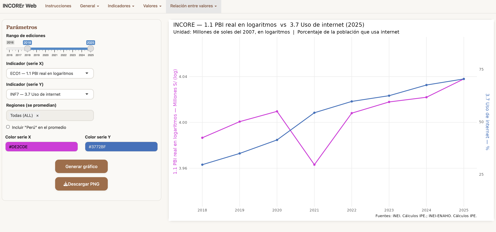
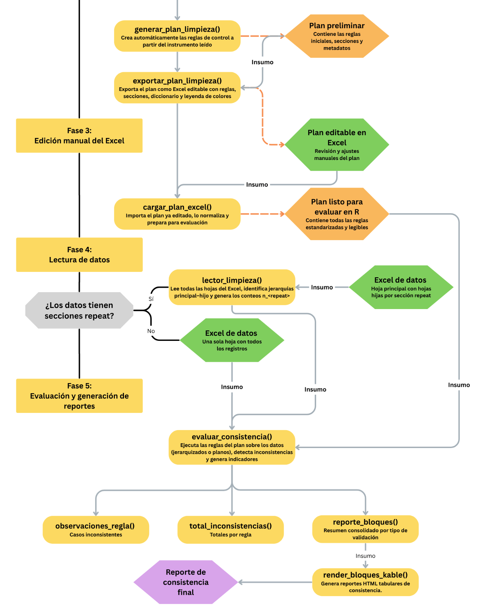
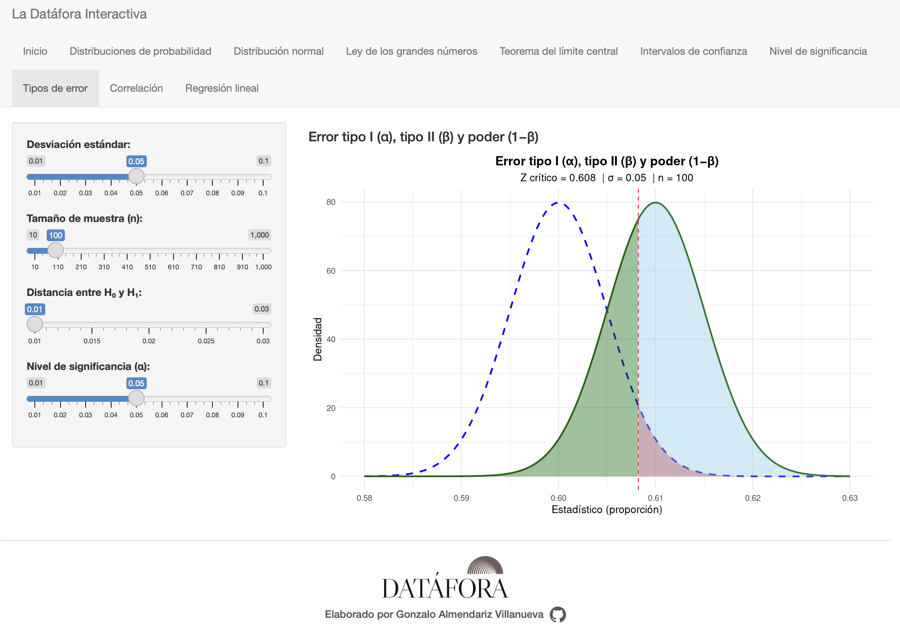
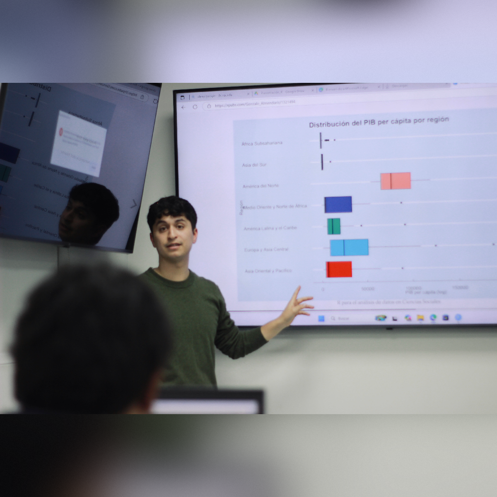

```{=html}
<nav class="floating-nav" aria-label="Navegación del CV">
  <ul class="floating-nav__list">
    <li><a href="#sobre-mi"    data-target="sobre-mi"    class="floating-nav__link is-active">Sobre mí</a></li>
    <li><a href="#experiencia" data-target="experiencia" class="floating-nav__link">Experiencia</a></li>
    <li><a href="#productos"   data-target="productos"   class="floating-nav__link">Productos</a></li>
    <li><a href="#proyectos"   data-target="proyectos"   class="floating-nav__link">Proyectos</a></li>
    <li><a href="#contacto"    data-target="contacto"    class="floating-nav__link">Contacto</a></li>
  </ul>
</nav>
```


```{=html}
<section class="section section--wide cv-hero reveal">
  <div class="container-narrow">
    <div class="cv-hero__inner">
      <h1 class="cv-hero__title">Gonzalo Almendariz Villanueva</h1>
      <p class="cv-hero__role">Analista de datos · Investigación social</p>
      <p class="cv-hero__value ldf-justo">
        Procesamiento y análisis de datos con enfoque reproducible, orientado a la automatización de tareas de limpieza, consistencia y recodificación en R, y al desarrollo de visualizaciones parametrizadas que integran precisión técnica y claridad comunicativa. Trabajo centrado en diseñar flujos de validación y análisis eficientes que garanticen la calidad de la información y faciliten la interpretación de resultados en diversos contextos de investigación aplicada, combinando rigor metodológico, eficiencia analítica y una sólida comunicación visual de los hallazgos.
      </p>

      <div class="cv-hero__actions">
        <div class="cv-hero__ctas">
          <a href="#experiencia" class="btn-main">Experiencia laboral</a>
          <a href="#proyectos"   class="btn-main">Proyectos</a>
        </div>
        <div class="cv-hero__social">
          <a href="https://github.com/GonzaloAlmendariz" target="_blank" rel="noopener" aria-label="GitHub">
            <svg viewBox="0 0 24 24" width="22" height="22" aria-hidden="true">
              <path fill="currentColor" d="M12 .5a12 12 0 0 0-3.79 23.4c.6.11.82-.26.82-.57v-2.06c-3.34.73-4.04-1.61-4.04-1.61-.55-1.39-1.35-1.76-1.35-1.76-1.1-.76.08-.74.08-.74 1.21.09 1.85 1.25 1.85 1.25 1.08 1.85 2.83 1.31 3.52 1 .11-.79.42-1.31.77-1.61-2.67-.31-5.47-1.34-5.47-5.96 0-1.32.47-2.39 1.24-3.23-.12-.31-.54-1.57.12-3.27 0 0 1.01-.32 3.3 1.23a11.5 11.5 0 0 1 6 0c2.28-1.55 3.29-1.23 3.29-1.23.66 1.7.24 2.96.12 3.27.77.84 1.23 1.91 1.23 3.23 0 4.63-2.8 5.64-5.48 5.95.43.37.82 1.1.82 2.22v3.29c0 .31.22.68.83.57A12 12 0 0 0 12 .5Z"/>
            </svg>
          </a>
          <a href="https://www.linkedin.com/in/gonzalo-almendariz-villanueva-051587324/" target="_blank" rel="noopener" aria-label="LinkedIn">
            <svg viewBox="0 0 24 24" width="22" height="22" aria-hidden="true">
              <path fill="currentColor" d="M19 3A2.9 2.9 0 0 1 22 6V18A2.9 2.9 0 0 1 19 21H5A2.9 2.9 0 0 1 2 18V6A2.9 2.9 0 0 1 5 3H19M8.3 17V10H5.6V17H8.3M6.9 8.7A1.6 1.6 0 1 0 6.9 5.5 1.6 1.6 0 0 0 6.9 8.7M18.4 17V13.2C18.4 11 17.3 10 15.6 10A2.4 2.4 0 0 0 13.4 11.1H13.3V10H10.6V17H13.4V13.5C13.4 12.3 13.9 11.6 14.9 11.6S16.3 12.3 16.3 13.5V17Z"/>
            </svg>
          </a>
        </div>
      </div>
    </div>
  </div>
</section>
```


```{=html}
<section id="sobre-mi" class="section section--tight about about--photo-sm reveal">
  <div class="container-narrow">
    <h2 class="h-compact">Sobre mí</h2>

    <div class="about-grid">
      <div class="about-text">
        <p class="section-lead ldf-justo">
          <strong>Analista de datos</strong> y <strong>bachiller en Ciencia Política por la Universidad Nacional Mayor de San Marcos</strong>.
          Trabajo con datos desde una perspectiva aplicada, combinando estadística, programación y visualización
          para crear herramientas útiles y reproducibles.
        </p>

        <p class="ldf-justo">
          Mi interés por los datos nació en la universidad, a partir de un curso que me dejó con más preguntas que respuestas.
          Quise entender mejor cómo usar la estadística para estudiar fenómenos sociales, y eso me llevó a aprender
          <strong>R de forma autodidacta</strong>.  
          Al principio fue curiosidad por un lenguaje nuevo, pero pronto descubrí todo lo que podía aportar a la investigación:
          la posibilidad de analizar, visualizar y compartir información de manera abierta y colaborativa.
        </p>

        <p class="ldf-justo" style="margin-bottom:0;">
          Desde entonces he trabajado de forma autodidacta en proyectos de análisis y procesamiento de datos,
          creando flujos que automatizan la limpieza, la consistencia y la visualización.  
          Ese camino terminó por convertirse en <strong>R para el análisis de datos de libre acceso</strong>,
          un libro pensado para enseñar estadística de forma práctica y accesible en español,
          y para seguir acercando el análisis de datos a más personas interesadas en entender y trabajar con información
          desde cualquier campo.
        </p>
      </div>

      <figure class="about-photo">
        
      </figure>
    </div>
  </div>
</section>
```


```{=html}
<section id="experiencia" class="section section--narrow reveal">
  <h2 class="h-compact">Experiencia laboral</h2>

  <div class="timeline">

    <!-- PULSO PUCP -->
    <article class="timeline-item reveal-delay-1">
      <div class="timeline-head">
        <span class="timeline-role">Analista de datos</span>
        <span class="timeline-org">· PULSO PUCP</span>
        <span class="timeline-date">2025–actualidad</span>
      </div>
      <p class="timeline-body ldf-justo">
        Trabajo en proyectos de investigación social aplicados a temas de <strong>protección, educación y movilidad humana</strong>,
        en colaboración con organismos internacionales como ACNUR.  
        Responsable del <strong>procesamiento y control de calidad de bases de datos</strong>, el diseño de
        <strong>flujos automatizados de consistencia y limpieza en R</strong>, y la <strong>visualización reproducible de resultados</strong>.  
        Participación activa en la <strong>documentación metodológica</strong> y la <strong>coordinación de procesos técnicos</strong>
        entre equipos de campo y análisis.
      </p>
      <div class="chips">
        <span class="chip">R</span><span class="chip">tidyverse</span>
        <span class="chip">SPSS</span><span class="chip">SQL</span>
        <span class="chip">Quarto</span><span class="chip">Visualización</span>
      </div>
    </article>

    <!-- Skill / Lima Educa -->
    <article class="timeline-item reveal-delay-2">
      <div class="timeline-head">
        <span class="timeline-role">Docente — Análisis de Datos con R</span>
        <span class="timeline-org">· Plataforma Skill / Programa Lima Educa, Municipalidad de Lima</span>
        <span class="timeline-date">2025</span>
      </div>
      <p class="timeline-body ldf-justo">
        Docente del curso <em>“Análisis de Datos con R: procesamiento, visualización y métodos inferenciales”</em>,
        dirigido a estudiantes y profesionales en formación digital.  
        El programa abordó la <strong>gramática de los datos</strong>, la <strong>visualización con ggplot2</strong>
        y la <strong>interpretación estadística</strong> mediante un enfoque práctico y reproducible.
      </p>
      <div class="chips">
        <span class="chip">R</span><span class="chip">ggplot2</span>
        <span class="chip">dplyr</span><span class="chip">Inferencia</span>
        <span class="chip">Formación digital</span>
      </div>
    </article>

    <!-- Fundación San Marcos -->
    <article class="timeline-item reveal-delay-3">
      <div class="timeline-head">
        <span class="timeline-role">Docente — Análisis de Datos Cuantitativos con R aplicado a las Ciencias Sociales</span>
        <span class="timeline-org">· Fundación San Marcos / Centro Cultural de San Marcos</span>
        <span class="timeline-date">2025</span>
      </div>
      <p class="timeline-body ldf-justo">
        Diseño e impartición de un curso práctico orientado al uso de R y RStudio en investigación social.
        Ocho sesiones sobre <strong>exploración, visualización, inferencia y regresión</strong>,
        integrando fundamentos estadísticos con ejemplos aplicados y la elaboración de
        <strong>informes reproducibles</strong> en Quarto.
      </p>
      <div class="chips">
        <span class="chip">R</span><span class="chip">Estadística aplicada</span>
        <span class="chip">Docencia</span><span class="chip">Inferencia</span>
        <span class="chip">Regresión</span>
      </div>
    </article>

    <!-- PNUD · CAF -->
    <article class="timeline-item reveal-delay-4">
      <div class="timeline-head">
        <span class="timeline-role">Analista de datos — Voces para el Futuro</span>
        <span class="timeline-org">· PNUD y CAF</span>
        <span class="timeline-date">2024</span>
      </div>
      <p class="timeline-body ldf-justo">
        Análisis de resultados de la consulta regional <em>“Voces para el Futuro”</em>,
        orientada a recoger percepciones ciudadanas sobre desarrollo en América Latina y el Caribe.  
        Aplicación de <strong>técnicas de análisis de texto y sentimiento</strong> sobre más de mil respuestas abiertas,
        y desarrollo de <strong>visualizaciones interactivas</strong> en R para la presentación de hallazgos.
      </p>
      <div class="chips">
        <span class="chip">R</span><span class="chip">tidyverse</span>
        <span class="chip">PLN</span><span class="chip">STM</span>
        <span class="chip">Visualización</span>
      </div>
    </article>

    <!-- Métrica 23 -->
    <article class="timeline-item reveal-delay-5">
      <div class="timeline-head">
        <span class="timeline-role">Docente — Cursos Dominio R y Análisis Estadístico con R</span>
        <span class="timeline-org">· Métrica 23</span>
        <span class="timeline-date">2024</span>
      </div>
      <p class="timeline-body ldf-justo">
        Conducción de cursos orientados al desarrollo de competencias en <strong>análisis estadístico</strong>
        y <strong>comunicación técnica</strong>.  
        Enfoque en <strong>flujos reproducibles</strong> y en la <strong>visualización de datos como herramienta de interpretación</strong>
        dentro de proyectos de investigación aplicada.
      </p>
      <div class="chips">
        <span class="chip">R</span><span class="chip">Estadística aplicada</span>
        <span class="chip">Docencia</span><span class="chip">Visualización</span>
      </div>
    </article>

    <!-- COIRECIP -->
    <article class="timeline-item reveal-delay-6">
      <div class="timeline-head">
        <span class="timeline-role">Coordinador general — Congreso Nacional e Internacional de Ciencia Política (COIRECIP)</span>
        <span class="timeline-org">· UNMSM</span>
        <span class="timeline-date">2023</span>
      </div>
      <p class="timeline-body ldf-justo">
        <strong>Planificación y coordinación académica</strong> del COIRECIP 2023, con más de 300 asistentes y 40 ponencias.  
        Gestión del equipo organizador, programación de sesiones híbridas y enlace con medios institucionales
        para la cobertura del evento.
      </p>
      <div class="chips">
        <span class="chip">Gestión académica</span><span class="chip">Planificación</span><span class="chip">Comunicación</span>
      </div>
    </article>

  </div>
</section>
```


```{=html}
<section id="productos" class="section section--narrow reveal">
  <h2 class="h-compact">Productos</h2>

  <!-- ========== INCOREr ========== -->
  <article class="product-card reveal-delay-1">
    <figure class="product-figure">
      
    </figure>

    <div class="product-right">
      <header class="product-header">
        
        <h3 class="product-title">INCOREr</h3>
      </header>

      <div class="product-panel">
        <p class="product-desc ldf-justo">
          <strong>INCOREr</strong> es un paquete de R que permite analizar y visualizar los resultados del 
          <strong>Índice de Competitividad Regional (INCORE)</strong> del <strong>IPE</strong>. 
          Facilita la lectura de las bases oficiales y la creación de tablas y gráficos que comparan los indicadores 
          de competitividad entre regiones del Perú y a lo largo del tiempo. 
          Su complemento, <strong>IncoreR Web</strong>, ofrece una versión interactiva basada en <em>Shiny</em>, 
          que permite explorar resultados y descargar visualizaciones sin necesidad de programar.
        </p>
      </div>

      <div class="product-sideinfo">
        <div class="taglist taglist--tight">
          <span class="tag">INCORE · IPE</span><span class="tag">Comparaciones regionales</span>
          <span class="tag">Series históricas</span><span class="tag">Mapas</span>
          <span class="tag">Generador de visualizaciones</span><span class="tag">Shiny interactivo</span>
        </div>

        <div class="product-ctas">
          <a class="btn-main btn-compact" href="https://rpubs.com/Gonzalo_Almendariz/incorer" target="_blank" rel="noopener">Ver manual</a>
          <a class="btn-icon" href="https://github.com/GonzaloAlmendariz/incorer" target="_blank" rel="noopener" aria-label="Repositorio GitHub INCOREr">
            <svg xmlns="http://www.w3.org/2000/svg" viewBox="0 0 24 24" width="22" height="22" aria-hidden="true">
              <path fill="currentColor" d="M12 .5a12 12 0 0 0-3.79 23.4c.6.11.82-.26.82-.58
                0-.29-.01-1.05-.02-2.07-3.34.73-4.04-1.61-4.04-1.61-.55-1.41-1.35-1.79-1.35-1.79
                -1.1-.75.08-.73.08-.73 1.22.09 1.86 1.26 1.86 1.26 1.08 1.85 2.82 1.31 3.5 1
                .11-.78.42-1.31.76-1.61-2.67-.3-5.48-1.33-5.48-5.9
                0-1.3.47-2.38 1.24-3.22-.13-.31-.54-1.56.12-3.25
                0 0 1.01-.32 3.3 1.23a11.5 11.5 0 0 1 6 0c2.28-1.55
                3.29-1.23 3.29-1.23.66 1.69.25 2.94.12 3.25.77.84
                1.23 1.92 1.23 3.22 0 4.58-2.81 5.6-5.49 5.9.43.37.81
                1.1.81 2.23 0 1.61-.01 2.9-.01 3.29 0 .32.22.7.83.58
                A12 12 0 0 0 12 .5z"/>
            </svg>
          </a>
        </div>
      </div>
    </div>
  </article>

  <!-- ========== Prosecnur ========== -->
  <article class="product-card reveal-delay-2">
    <figure class="product-figure">
      
    </figure>

    <div class="product-right">
      <header class="product-header">
        
        <h3 class="product-title">Prosecnur</h3>
      </header>

      <div class="product-panel">
        <p class="product-desc ldf-justo">
          <strong>Prosecnur</strong> es un paquete de R que automatiza la <strong>limpieza, verificación y documentación</strong> de encuestas desarrolladas con formularios tipo <em>XLSForm</em> 
          (usados en plataformas como <strong>KoBoToolbox</strong> u <strong>ODK</strong>). 
          A partir de la estructura del cuestionario, el paquete genera reglas que validan si las respuestas son coherentes, 
          completas y se ajustan a los rangos esperados, detecta errores lógicos o saltos de pregunta mal aplicados 
          y produce reportes de control de calidad totalmente reproducibles. 
          Aunque fue desarrollado en el marco de proyectos del <strong>ACNUR</strong>, su diseño es adaptable a cualquier estudio 
          que busque garantizar la consistencia y trazabilidad técnica de sus datos.
        </p>
      </div>

      <div class="product-sideinfo">
        <div class="taglist taglist--tight">
          <span class="tag">Encuestas</span>
          <span class="tag">Procesamiento automatizado</span>
          <span class="tag">Verificación y limpieza</span>
          <span class="tag">Calidad y consistencia</span>
          <span class="tag">Trazabilidad</span>
          <span class="tag">Reproducibilidad</span>
        </div>

        <div class="product-ctas">
          <a class="btn-main btn-compact" href="https://rpubs.com/Gonzalo_Almendariz/Prosecnur" target="_blank" rel="noopener">Ver manual</a>
          <a class="btn-icon" href="https://github.com/GonzaloAlmendariz/Prosecnur" target="_blank" rel="noopener" aria-label="Repositorio GitHub Prosecnur">
            <svg xmlns="http://www.w3.org/2000/svg" viewBox="0 0 24 24" width="22" height="22" aria-hidden="true">
              <path fill="currentColor" d="M12 .5a12 12 0 0 0-3.79 23.4c.6.11.82-.26.82-.58
                0-.29-.01-1.05-.02-2.07-3.34.73-4.04-1.61-4.04-1.61-.55-1.41-1.35-1.79-1.35-1.79
                -1.1-.75.08-.73.08-.73 1.22.09 1.86 1.26 1.86 1.26 1.08 1.85 2.82 1.31 3.5 1
                .11-.78.42-1.31.76-1.61-2.67-.3-5.48-1.33-5.48-5.9
                0-1.3.47-2.38 1.24-3.22-.13-.31-.54-1.56.12-3.25
                0 0 1.01-.32 3.3 1.23a11.5 11.5 0 0 1 6 0c2.28-1.55
                3.29-1.23 3.29-1.23.66 1.69.25 2.94.12 3.25.77.84
                1.23 1.92 1.23 3.22 0 4.58-2.81 5.6-5.49 5.9.43.37.81
                1.1.81 2.23 0 1.61-.01 2.9-.01 3.29 0 .32.22.7.83.58
                A12 12 0 0 0 12 .5z"/>
            </svg>
          </a>
        </div>
      </div>
    </div>
  </article>

  <!-- ========== R para el análisis de datos ========== -->
  <article class="product-card reveal-delay-3">
    <figure class="product-figure">
      
    </figure>

    <div class="product-right">
      <header class="product-header">
        
        <h3 class="product-title">R para el análisis de datos</h3>
      </header>

      <div class="product-panel">
        <p class="product-desc ldf-justo">
          <strong>R para el análisis de datos</strong> es un libro que busca democratizar el aprendizaje de la estadística aplicada a las ciencias sociales, integrando teoría, práctica y reflexión crítica. A través de explicaciones claras y ejemplos reproducibles en <strong>R</strong>, enseña a razonar con datos más que a memorizar fórmulas, mostrando cómo cada decisión analítica se relaciona con preguntas reales de investigación. Su complemento digital, la <strong>Datafóra interactiva</strong>, permite interactuar de forma activa con los coneptos teóricos del libro de forma intuitiva.
        </p>
      </div>

      <div class="product-sideinfo">
        <div class="taglist taglist--tight">
          <span class="tag">Estadística aplicada</span>
          <span class="tag">Ciencias sociales</span>
          <span class="tag">R y reproducibilidad</span>
          <span class="tag">Simulaciones y gráficos</span>
          <span class="tag">Didáctica y accesibilidad</span>
          <span class="tag">Datafóra interactiva</span>
        </div>

        <div class="product-ctas">
          <a class="btn-main btn-compact" href="https://ladatafora.github.io/libro" target="_blank" rel="noopener">Leer online</a>
          <a class="btn-icon" href="https://github.com/GonzaloAlmendariz/ladatafora" target="_blank" rel="noopener" aria-label="Repositorio GitHub Libro R para el análisis de datos">
            <svg xmlns="http://www.w3.org/2000/svg" viewBox="0 0 24 24" width="22" height="22" aria-hidden="true">
              <path fill="currentColor" d="M12 .5a12 12 0 0 0-3.79 23.4c.6.11.82-.26.82-.58
                0-.29-.01-1.05-.02-2.07-3.34.73-4.04-1.61-4.04-1.61-.55-1.41-1.35-1.79-1.35-1.79
                -1.1-.75.08-.73.08-.73 1.22.09 1.86 1.26 1.86 1.26 1.08 1.85 2.82 1.31 3.5 1
                .11-.78.42-1.31.76-1.61-2.67-.3-5.48-1.33-5.48-5.9
                0-1.3.47-2.38 1.24-3.22-.13-.31-.54-1.56.12-3.25
                0 0 1.01-.32 3.3 1.23a11.5 11.5 0 0 1 6 0c2.28-1.55
                3.29-1.23 3.29-1.23.66 1.69.25 2.94.12 3.25.77.84
                1.23 1.92 1.23 3.22 0 4.58-2.81 5.6-5.49 5.9.43.37.81
                1.1.81 2.23 0 1.61-.01 2.9-.01 3.29 0 .32.22.7.83.58
                A12 12 0 0 0 12 .5z"/>
            </svg>
          </a>
        </div>
      </div>
    </div>
  </article>
</section>
```


```{=html}
<section id="proyectos" class="section section--narrow reveal">
  <h2 class="h-compact">Proyectos</h2>

  <!-- Voces para el Futuro — PNUD · CAF -->
  <article class="case-card reveal-delay-1">
    <figure class="case-figure">
      
    </figure>
    <div class="case-content">
      <header class="case-header">
        <h3 class="case-title">Voces para el Futuro — PNUD · CAF</h3>
      </header>
      <div class="case-panel">
        <p class="case-desc ldf-justo">
          Consulta regional sobre percepciones ciudadanas de desarrollo y gobernanza en América Latina y el Caribe. 
          Se diseñó un flujo reproducible en R para la limpieza y normalización de texto, integración de variables demográficas 
          y modelado de temas con <em>Structural Topic Model</em> (STM). La síntesis combinó análisis descriptivo, gráficos comparados 
          y lectura cualitativa de tópicos para comunicar patrones discursivos de forma clara y verificable.
        </p>
        <div class="case-cta">
          <a class="btn-main btn-compact" href="https://rpubs.com/Gonzalo_Almendariz/1362876" target="_blank" rel="noopener">Ver proyecto</a>
        </div>
      </div>
    </div>
  </article>

  <!-- Universidad del Pacífico — sesión 2025 -->
  <article class="case-card reveal-delay-2">
    <figure class="case-figure">
      
    </figure>
    <div class="case-content">
      <header class="case-header">
        <h3 class="case-title">Universidad del Pacífico — Manipulación de datos y visualización</h3>
      </header>
      <div class="case-panel">
        <p class="case-desc ldf-justo">
          Sesión aplicada orientada a la gramática de datos en R (transformaciones con <code>dplyr</code> y <code>tidyr</code>), 
          criterios de calidad en visualización (<code>ggplot2</code>) y comunicación de resultados. Se desarrollaron 
          ejemplos reproducibles que recorren el ciclo completo: depuración, verificación de supuestos, elección de formas 
          gráficas y buenas prácticas de anotación y escala para audiencias técnicas y no técnicas.
        </p>
        <div class="case-cta">
          <a class="btn-main btn-compact" href="#" target="_blank" rel="noopener">Ver proyecto</a>
        </div>
      </div>
    </div>
  </article>

  <!-- Elecciones Generales 2021 — Evaluación con Ley de Benford -->
  <article class="case-card reveal-delay-3">
    <figure class="case-figure">
      
    </figure>
    <div class="case-content">
      <header class="case-header">
        <h3 class="case-title">Elecciones 2021 — Evaluación de integridad con la Ley de Benford</h3>
      </header>
      <div class="case-panel">
        <p class="case-desc ldf-justo">
          Exploración de la distribución de primeros dígitos en resultados electorales y contraste con expectativas 
          teóricas de la Ley de Benford. El reporte discute alcances y limitaciones metodológicas (heterogeneidad de unidades, 
          efectos de truncamiento, escalamiento y agregación), y presenta gráficos y tablas comparativas que orientan una lectura 
          prudente de indicadores de integridad electoral.
        </p>
        <div class="case-cta">
          <a class="btn-main btn-compact" href="#" target="_blank" rel="noopener">Ver proyecto</a>
        </div>
      </div>
    </div>
  </article>

  <!-- Pensión 65 — Elaboración de gráficos -->
  <article class="case-card reveal-delay-4">
    <figure class="case-figure">
      
    </figure>
    <div class="case-content">
      <header class="case-header">
        <h3 class="case-title">Pensión 65 — Elaboración de gráficos para informe técnico</h3>
      </header>
      <div class="case-panel">
        <p class="case-desc ldf-justo">
          Conjunto de visualizaciones para caracterizar población beneficiaria y comunicar indicadores clave. 
          Se sistematizó un repertorio de gráficos comparables por subgrupos y regiones, priorizando legibilidad, 
          consistencia tipográfica y escalas homogéneas para favorecer la interpretación y el uso operativo 
          en reportes institucionales.
        </p>
        <div class="case-cta">
          <a class="btn-main btn-compact" href="#" target="_blank" rel="noopener">Ver proyecto</a>
        </div>
      </div>
    </div>
  </article>
  
  
  
  

</section>
```


----


```{=html}
<section id="contacto" class="section reveal">
  <div class="contacto-pro">
    <div class="contact-card">
      <header class="contact-head">
        <div class="contact-badge" aria-hidden="true">Contacto</div>
        <h2 class="contact-title">
          Conversemos
          <span class="contact-underline" aria-hidden="true"></span>
        </h2>
      </header>

      <p class="contact-text ldf-justo">
        En este momento trabajo en <strong>PULSO PUCP</strong> en proyectos relacionados con el
        <strong>procesamiento y análisis de datos</strong>, además de mantener una línea constante de <strong>docencia y aprendizaje en R</strong>.
        No estoy en búsqueda de una posición a tiempo completo, pero me interesa seguir <strong>colaborando, aprendiendo y aportando</strong>
        en proyectos que integren investigación, visualización o formación en ciencia de datos.  
        Si crees que hay algo en lo que podríamos trabajar juntos, puedes escribirme por correo electrónico.
      </p>

      <a class="btn-main btn-compact contact-btn" href="mailto:gonzaloalmendariz@gmail.com">
        <svg class="mail-ic" viewBox="0 0 24 24" width="20" height="20" aria-hidden="true">
          <path fill="currentColor" d="M20 4H4a2 2 0 0 0-2 2v12a2 2 0 0 0 2 2h16a2 
          2 0 0 0 2-2V6a2 2 0 0 0-2-2Zm0 2-8 5L4 6h16ZM4 18V8l8 5 8-5v10H4Z"/>
        </svg>
        Evíame un correo
      </a>

      <div class="contact-meta">
        <span class="contact-mail">gonzaloalmendariz@gmail.com</span>
      </div>
    </div>
  </div>
</section>
```


```{=html}
<!-- FOOTER limpio: logo arriba, autor y GitHub debajo -->
<div style="
  margin-top: 40px;
  padding: 22px 0 18px 0;
  border-top: 1px solid #ddd;
  text-align: center;
  color: #555;
  font-size: 0.95rem;
">
  
  <div style="font-weight:500; margin-bottom:6px;">
    Elaborado por Gonzalo Almendariz Villanueva
  </div>
  <a href="https://github.com/gonzaloalmendariz" target="_blank" aria-label="GitHub"
     style="display:inline-block;">
    
  </a>
</div>
```


```{=html}
<script>
document.addEventListener('DOMContentLoaded', () => {
  /* ---------- REVEAL ---------- */
  const ioReveal = new IntersectionObserver((entries)=>{
    entries.forEach(e=>{
      if(e.isIntersecting){
        e.target.classList.add('is-visible');
        ioReveal.unobserve(e.target);
      }
    });
  }, { threshold: 0.1 });
  document.querySelectorAll('.reveal').forEach(el => ioReveal.observe(el));

  /* ---------- FLOATING NAV ---------- */
  const nav   = document.querySelector('nav.floating-nav');
  if (!nav) return;

  const links = Array.from(document.querySelectorAll('.floating-nav__link'));
  const ids   = links.map(a => a.dataset.target).filter(Boolean);
  const secs  = ids.map(id => document.getElementById(id)).filter(Boolean);

  if (secs.length){
    const ioSpy = new IntersectionObserver((entries)=>{
      entries.forEach(entry=>{
        if(entry.isIntersecting){
          const id = entry.target.id;
          links.forEach(a => a.classList.toggle('is-active', a.dataset.target === id));
        }
      });
    }, { rootMargin: '-30% 0px -60% 0px', threshold: 0.01 });
    secs.forEach(sec => ioSpy.observe(sec));
  }

  let lastY = window.pageYOffset || 0, ticking = false;
  function onScroll(){
    const y = window.pageYOffset || 0, dy = y - lastY;
    if (dy < -6) nav.classList.add('is-visible');   // subiendo
    else if (dy > 6) nav.classList.remove('is-visible'); // bajando
    lastY = y; ticking = false;
  }
  window.addEventListener('scroll', () => {
    if (!ticking) { window.requestAnimationFrame(onScroll); ticking = true; }
  }, { passive: true });

  nav.classList.remove('is-visible');
  nav.addEventListener('focusin', () => nav.classList.add('is-visible'));
});
</script>
```


```{=html}
<style>
/* ===================== CONTACTO — restauración y blindaje ===================== */
#contacto .contacto-pro{ display:grid; place-items:center; padding:clamp(28px,6vw,64px) 16px; }
#contacto .contact-card{
  position:relative; width:min(820px,92vw);
  padding:clamp(22px,3.4vw,34px);
  background: color-mix(in srgb, white 88%, var(--bg-soft) 12%) !important;
  border:1px solid color-mix(in srgb, var(--border) 85%, white 15%) !important;
  border-radius:18px !important;
  box-shadow:0 10px 30px rgba(0,0,0,.08) !important;
  backdrop-filter:blur(6px) !important; -webkit-backdrop-filter:blur(6px) !important;
}
#contacto .contact-card::after{
  content:""; position:absolute; inset:-1px; border-radius:18px; pointer-events:none;
  box-shadow: inset 0 0 0 1px rgba(255,255,255,.35);
}

/* Encabezado */
#contacto .contact-head{ display:flex; align-items:baseline; justify-content:space-between; gap:12px; margin-bottom:8px; }
#contacto .contact-badge{
  font-size:.82rem; font-weight:700; letter-spacing:.04em; text-transform:uppercase;
  color: color-mix(in srgb, var(--accent) 80%, black 20%);
  background: color-mix(in srgb, var(--accent) 10%, white 90%);
  border:1px solid color-mix(in srgb, var(--accent) 18%, var(--border) 82%);
  padding:4px 10px; border-radius:999px;
}
#contacto .contact-title{
  position:relative; margin:0 0 10px 0; font-family:"Literata","Georgia",serif;
  color:var(--accent); font-weight:700; letter-spacing:-0.01em; font-size:clamp(1.4rem,3.4vw,2rem);
}
#contacto .contact-underline{
  position:absolute; left:0; bottom:-6px; width:160px; height:2px;
  background:linear-gradient(90deg, color-mix(in srgb, var(--accent) 62%, white 38%), transparent 80%);
  border-radius:2px;
}

/* Texto */
#contacto .contact-text{ margin:16px 0 22px 0; color:var(--text); line-height:1.85; font-size:1.05rem; }

/* Botón */
#contacto .contact-btn{
  display:inline-flex; align-items:center; gap:10px; padding:14px 26px;
  border-radius:14px; box-shadow:0 8px 18px rgba(0,0,0,.08);
  background:var(--accent); color:#fff !important; border:1px solid transparent;
  transition:background-color .25s, box-shadow .25s, transform .18s;
}
#contacto .contact-btn:hover{ background-color: color-mix(in srgb, var(--accent) 90%, white 10%); box-shadow:0 10px 24px rgba(0,0,0,.12); transform:translateY(-2px); }
#contacto .mail-ic{ opacity:.95; }

/* Línea de apoyo */
#contacto .contact-meta{ margin-top:14px; color:#5a5a5a; font-size:.96rem; }
#contacto .contact-mail{ user-select:text; font-variant-numeric:lining-nums; }

/* Neutralizar hovers globales dentro de #contacto (no pintar enlaces normales) */
#contacto a:not(.contact-btn):hover,
#contacto a:not(.contact-btn):focus{
  background:none !important; color:inherit !important; border-radius:0 !important; text-decoration:underline;
}

/* Reveal local (por si lo pisa algo) */
#contacto .reveal{ opacity:0; transform:translateY(18px); transition:opacity .6s ease, transform .6s ease; }
#contacto .reveal.is-visible{ opacity:1; transform:none; }

/* ===================== IMÁGENES Productos/Proyectos — sin deformación ===================== */
#productos .product-figure img,
#proyectos .case-figure img{
  width:100% !important; height:auto !important; object-fit:contain !important;
  display:block !important; border-radius:14px; box-shadow:var(--shadow-m);
}
</style>
```


