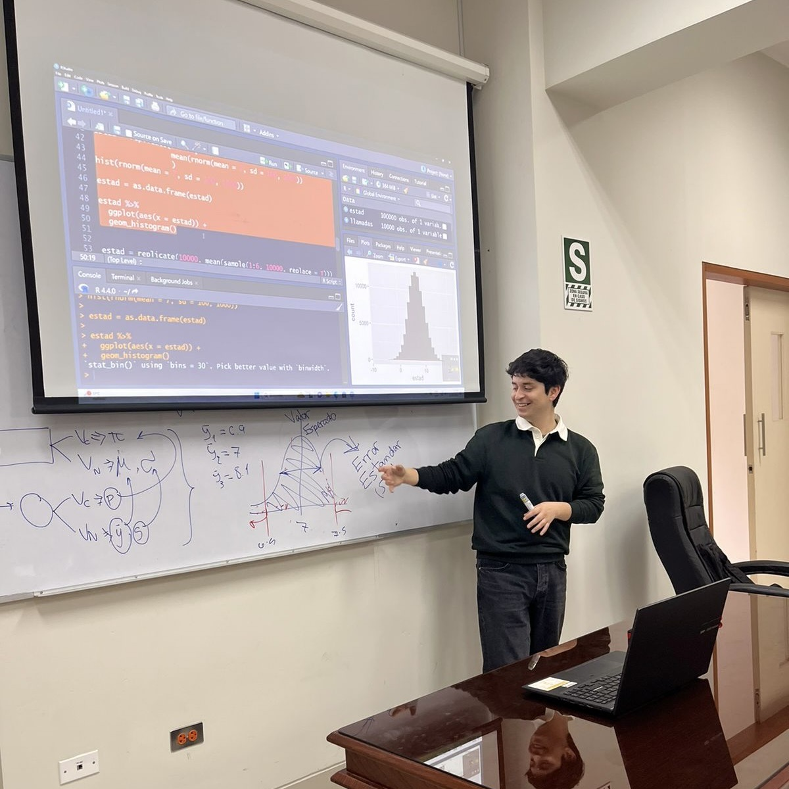

 ---
title: false
page-layout: full
format:
  html:
    toc: false
    smooth-scroll: true
editor: visual
---

```{=html}
<!-- HERO — Bienvenida principal (centrado, limpio y con punch) -->
<style>
  .hero-pro{
    position:relative;
    padding:clamp(60px,10vw,120px) 16px clamp(50px,8vw,100px);
    background:linear-gradient(
      180deg,
      color-mix(in srgb, var(--bg) 98%, white 2%) 0%,
      color-mix(in srgb, var(--bg-soft) 100%, white 5%) 100%
    );
    border-bottom:1px solid var(--border);
    text-align:center;
    overflow:hidden;
  }
  .hero-pro__inner{ max-width:1000px; margin:0 auto; position:relative; }

  /* Logo sin sombra (respeta transparencia) */
  .hero-pro__logo{
    height:clamp(70px,10vw,100px);
    width:auto;
    display:block;
    margin:0 auto 20px auto;
    filter:none !important;
    image-rendering:-webkit-optimize-contrast;
  }

  .hero-pro__title{
    margin:0 0 12px 0;
    font-family:"Literata","Georgia",serif;
    font-weight:800;
    color:var(--accent);
    font-size:clamp(2rem,5.5vw,2.6rem);
    letter-spacing:-0.015em;
    line-height:1.2;
    position:relative;
    display:inline-block;
  }
  .hero-pro__title::after{
    content:"";
    display:block;
    width:180px; height:2px;
    margin:.6rem auto 0 auto;
    background:linear-gradient(90deg,
      color-mix(in srgb, var(--accent) 75%, white 25%) 0%,
      transparent 90%);
    border-radius:2px;
  }

  .hero-pro__lead{
    margin:24px auto 0 auto;
    max-width:740px;
    color:var(--text);
    font-size:clamp(1.05rem,1.8vw,1.2rem);
    line-height:1.9;
    text-align:center;
  }

  /* Luz suave superior (sin “sombra gris”) */
  .hero-pro::before{
    content:"";
    position:absolute; inset:0;
    background:radial-gradient(circle at 50% 10%,
      rgba(255,255,255,.85) 0%,
      rgba(255,255,255,.6) 28%,
      transparent 70%);
    pointer-events:none;
    opacity:.7;
  }

  /* Animación reveal (opcional) */
  .hero-pro.reveal{ opacity:0; transform:translateY(18px); transition:opacity .6s ease, transform .6s ease; }
  .hero-pro.reveal.is-visible{ opacity:1; transform:none; }
  @media (prefers-reduced-motion: reduce){
    .hero-pro.reveal{ transition:none !important; transform:none !important; }
  }
  @media (max-width:600px){
    .hero-pro__title::after{ width:120px; }
    .hero-pro__lead{ font-size:1rem; }
  }
</style>

<section class="hero-pro reveal" aria-labelledby="hero-title">
  <div class="hero-pro__inner">
    
    <h1 id="hero-title" class="hero-pro__title">Bienvenido a La Datáfora</h1>
    <p class="hero-pro__lead">
      La Datáfora reúne trabajo, ideas y recursos sobre análisis de datos en ciencias sociales:
      publicaciones, materiales didácticos y avances de proyectos en R y Python, con un enfoque
      reproducible y aplicado.
    </p>
  </div>
</section>
```


# **Conoce el libro**

``` {=html}        
<!-- ============================================================
     LIBRO — R para el Análisis de Datos (stack limpio, sin sombras)
     ============================================================ -->
<style>
  .ld-libro {
    --bg: #f9f7f3;
    --bg-soft: #f6f3ef;
    --text: #2b2b2b;
    --accent: #8a5a44;
    --accent2: #c7a47a;
    --border: #e0dcd5;

    padding: clamp(48px, 7vw, 96px) 16px;
    background: var(--bg);                /* 🔹 fondo plano sin degradado */
    border-top: 1px solid var(--border);
  }
  .ld-libro__wrap {
    max-width: 1100px;
    margin: 0 auto;
  }

  /* Portada sin sombra */
  .ld-libro__cover {
    margin: 0 auto 18px auto;
    border-radius: 18px;
    overflow: hidden;
    line-height: 0;
    background: var(--bg-soft);
    max-width: 920px;
  }
  .ld-libro__cover img {
    display: block;
    width: 100%;
    height: auto;
    object-fit: cover;
    border: 0; margin: 0; padding: 0;
  }

  /* Ficha sin sombras exteriores */
  .ld-libro__card {
    position: relative;
    max-width: 920px;
    margin: 0 auto;
    background: color-mix(in srgb, white 92%, var(--bg-soft) 8%);
    border: 1px solid color-mix(in srgb, var(--border) 90%, white 10%);
    border-radius: 16px;
    padding: clamp(24px, 3vw, 34px);
    overflow: clip;
    transition: border-color .25s ease, transform .18s ease;
  }

  /* Regla lateral degradada */
  .ld-libro__card::before{
    content:"";
    position:absolute; inset:0 auto 0 0;
    width: 5px;
    background: linear-gradient(
      180deg,
      color-mix(in srgb, var(--accent) 58%, white 42%) 0%,
      color-mix(in srgb, var(--accent2) 55%, white 45%) 100%
    );
    border-top-left-radius:16px;
    border-bottom-left-radius:16px;
  }

  /* Hover: solo eleva un poco, sin sombra */
  .ld-libro__card:hover{
    transform: translateY(-2px);
    border-color: color-mix(in srgb, var(--accent) 30%, var(--border) 70%);
  }

  /* Tipografía */
  .ld-libro__title{
    margin: 0 0 8px 0;
    font-family: "Literata","Georgia",serif;
    font-weight: 700;
    letter-spacing: -0.01em;
    color: var(--accent);
    font-size: clamp(1.6rem, 3.4vw, 2rem);
    line-height: 1.18;
  }
  .ld-libro__subtitle{
    margin: 6px 0 16px 0;
    font-weight: 700;
    color: #2f2f2f;
    font-size: 1.1rem;
  }
  .ld-libro__text{
    margin: 0 0 16px 0;
    line-height: 1.9;
    font-size: 1.04rem;
    color: var(--text);
    text-align: justify;
  }

  /* CTA centrada */
  .ld-libro__cta{
    margin-top: 16px;
    display: flex;
    justify-content: center;
  }
  .ld-libro__btn {
    background-color: var(--accent);
    color: #fff;
    padding: 12px 26px;
    border-radius: 12px;
    font-size: 1rem;
    font-weight: 600;
    border: 1px solid transparent;
    box-shadow: none;                        /* 🔹 sin sombra */
    transition: background-color .25s ease, transform .18s ease;
    text-decoration: none;
    display: inline-block;
  }
  .ld-libro__btn:hover,
  .ld-libro__btn:focus {
    background-color: color-mix(in srgb, var(--accent) 90%, white 10%);
    transform: translateY(-2px);
    color: #fff;
  }

  @media (max-width: 720px){
    .ld-libro__card{ padding: 20px; }
  }
</style>

<section id="libro" class="ld-libro" aria-labelledby="libro-title">
  <div class="ld-libro__wrap">

    <!-- Portada -->
    <figure class="ld-libro__cover">
      
    </figure>

    <!-- Ficha -->
    <div class="ld-libro__card">
      <h2 id="libro-title" class="ld-libro__title">R para el Análisis de Datos</h2>
      <h3 class="ld-libro__subtitle">R al alcance de todas y todos</h3>

      <p class="ld-libro__text">
        <em>R para el análisis de datos</em> es un libro y, al mismo tiempo, una propuesta.
        Su propósito es contribuir a que el conocimiento estadístico y computacional
        sea <strong>libre, accesible y aplicable</strong> para quienes investigan, enseñan o estudian
        en el campo de las <strong>ciencias sociales</strong>.
        Más que un manual técnico, constituye una guía práctica para comprender los fundamentos
        de la <strong>estadística descriptiva e inferencial</strong> y para incorporarlos al trabajo empírico mediante
        <strong>R, un lenguaje de programación abierto y colaborativo</strong>.
      </p>

      <p class="ld-libro__text">
        A lo largo de <strong>nueve capítulos progresivos</strong>, el libro recorre desde los principios
        de la medición y la exploración de datos hasta el análisis de regresión, integrando
        teoría, práctica y visualización.
        Cada sección incluye ejemplos aplicados, ejercicios interpretativos y fragmentos de código
        reproducibles, pensados para fortalecer la autonomía analítica y el criterio crítico en el uso de los datos.
      </p>

      <div class="ld-libro__cta">
        <a class="ld-libro__btn" href="libro.qmd">Más información</a>
      </div>
    </div>

  </div>
</section>
```

------------------------------------------------------------------------

## **Sobre el autor**

``` {=html}        
<div class="container-fluid ldf-section">
  <div class="row ldf-grid-gap" style="align-items:center;">

    <!-- Tres fotos + nombre -->
    <div class="col-sm-4" style="text-align:center;">
      <div class="d-flex justify-content-center flex-wrap" style="gap:16px; margin-bottom:12px;">

        

        

        

      </div>

      <div class="wp-element-caption" 
           style="font-weight:700;color:var(--accent);margin-top:4px;">
        Gonzalo Almendariz Villanueva
      </div>
    </div>

    <!-- Bio -->
    <div class="col-sm-8">
      <p class="ldf-justo" 
         style="margin:0;font-size:1.05rem;line-height:1.75;color:var(--text);">
        <strong>Bachiller en Ciencia Política por la Universidad Nacional Mayor de San Marcos</strong>, 
        con un interés considerable en <strong>la enseñanza, la divulgación y la estadística</strong>.  
        Me especializo en <strong>el análisis de datos aplicado a las ciencias sociales</strong> y busco promover una 
        comprensión accesible y crítica de la estadística.  
        He impartido cursos de <strong>programación estadística en R</strong>, orientados a fortalecer el uso 
        del lenguaje como herramienta para el análisis, la visualización y la comunicación de resultados.
      </p>
    </div>

  </div>
</div>
```


```{=html}
<!-- FOOTER limpio: logo arriba, autor y GitHub debajo -->
<div style="
  margin-top: 40px;
  padding: 22px 0 18px 0;
  border-top: 1px solid #ddd;
  text-align: center;
  color: #555;
  font-size: 0.95rem;
">
  <!-- Logo -->
  
  
  <!-- Texto -->
  <div style="font-weight:500; margin-bottom:6px;">
    Elaborado por Gonzalo Almendariz Villanueva
  </div>
  
  <!-- GitHub pequeño -->
  <a href="https://github.com/gonzaloalmendariz" target="_blank" aria-label="GitHub"
     style="display:inline-block;">
    
  </a>
</div>
```


```{=html}
<script>
document.addEventListener('DOMContentLoaded', function () {
  document.querySelectorAll('.reveal').forEach(function(el){
    el.classList.add('is-visible');
  });
});
</script>
```


